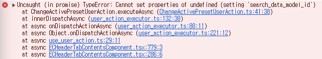
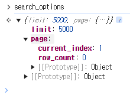
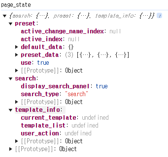

# Daily Retrospective

<br>

**작성자**: 고건호
**작성일시**: 2025-02-11

<br>

## 1. 오늘 업무 내용

<br>

- `시간 관리 업무` 및 `시간 관리 이력 업무`의 `조회 검색`, `현황 검색`에 `preset` 하드 코딩 적용
- `preset` 바꾸는 작업 시에 발생하는 에러 분석

<br>

### `시간 관리 업무` 및 `시간 관리 이력 업무`의 `조회 검색`, `현황 검색`에 `preset` 하드 코딩 적용

<br>

`시간 관리 업무` 및 `시간 관리 이력 업무`의 `조회 검색`과 `현황 검색`에 `preset` 하드 코딩을 적용했습니다.

<br>


<br>

```typescript
// time_manage_list_setup.ts
...
  menu: {
    attributes: [
      ...
      {
        prop_id: 'menu',
        attr_id: 'preset',
        attr_type: EN_ATTR_TYPE.Renderer,
        data: [
          {
						v5_key: {},
						data: {
							name: '이카운트',
							seq: '1',
							active: false,
							user_id: '용성',
							bizz_sid: 'B_000000E201767',
						},
					},
					{
						v5_key: {},
						data: {
							name: '고건호',
							seq: '2',
							active: false,
							user_id: '용성',
							bizz_sid: 'B_000000E201767',
						},
					},
					{
						v5_key: {},
						data: {
							name: 'kokeonho',
							seq: '3',
							active: false,
							user_id: '용성',
							bizz_sid: 'B_000000E201767',
						},
					},
        ]
      }
      ...
    ]
  }
...
```

<br>

위의 코드를 작성하니, 추가한 프리셋이 정상적으로 렌더링 되는 것을 확인할 수 있었습니다.

<br>

### `preset` 바꾸는 작업 시에 발생하는 에러 분석

<br>

프리셋 직접 추가까지는 원활하게 잘 됐지만, 다른 프리셋을 클릭하여 해당 프리셋을 적용하는 흐름에서 계속 에러가 발생했습니다.

<br>



<br>

디버깅 결과 `search_options`가 `undefined`임에도 `search_options.search_data_model_id` 프로퍼티를 할당하려는 코드 때문에 발생하는 문제였습니다.

<br>

`판매 현황`에서 프리셋을 변경할 때 어떤 흐름으로 프리셋 변경이 일어나는지 비교하며 해당 문제를 해결하려 했습니다.

<br>

`판매 현황`에서 프리셋을 변경했을 때 `search_options`는 아래와 같습니다.

<br>



<br>

```typescript
// ChangeActivePresetUserAction.ts
...
const search_options = request.vmc.getPageRuntimeWritable<ILastSearchOptionRuntime>(ILastSearchOptionRuntime);
...
```

<br>

`시간 관리 업무`를 위한 별개의 로직을 생성한게 아니기 때문에, 다른 곳에서 잘 동작하면 `시간 관리 업무`에서도 정상적으로 동작해야한다고 판단하여 디버깅을 하며 콜 스택을 거슬러 올라가며 흐름을 분석했습니다.

<br>

프리셋을 변경할 때, `Search` 클릭하여 `ToggleSearchPanelUserAction`을 실행시킬 때 모두 `vmc.page_runtime`에 데이터를 추가해주는 부분을 확인할 수가 없어서 새로고침 시에 데이터를 추가해주는 것으로 유추하고 새로고침 시 발생하는 함수 콜 스택을 살펴봤습니다.

<br>

`page_definition` 내부 `setup_provider`에 `SetupResolverProvider`가 할당되고

<br>

```typescript
// page_definition.ts
...
const setup_provider = request.execution_context?.getFeature<ISetupResolverProvider>(
		ISetupResolverProvider
	) as ISetupResolverProvider;
...
```

<br>

해당 파일 내부에서 `getMenuAttrResolverAsync()` 함수를 통해 사전에 선언한 `attribute` 파일을 찾고 이를 `page_state`에 추가해줍니다.

<br>

```typescript
// SetupResolverProvider.ts
...
async getMenuAttrResolverAsync(
		page_state: page_state.IPageState,
		page_viewmodel: IPageViewModel,
		page_runtime: IPageRuntime,
		setup: ISetup,
		resolve_target_menu_attributes?: IAttribute[]
	): Promise<page_state.IPageState> {
		const menu = setup.menu;
		const menu_type = this.execution_context.action.menu_type;
		const module_name = this.execution_context.moduleName.split('.')[1];

		if (!menu) {
			return page_state;
		}

		for (const attribute of resolve_target_menu_attributes ?? setup.menu.attributes ?? []) {
			/**
			 * 파일명임을 어떻게 알려주지 ?
			 */
			const attrResolver = ((menu_resolver as any)[`${attribute.attr_id}_${menu_type?.toLowerCase()}_resolver`] ??
				(menu_resolver as any)[
					`${attribute.attr_id}_${menu_type?.toLowerCase()}_${module_name?.toLowerCase()}_resolver`
				] ??
				(menu_resolver as any)[`${attribute.attr_id}_resolver`]) as IMenuResolver<any>;

			if (!attrResolver) {
				continue;
			}

			attrResolver({
				execution_context: this.execution_context,
				page_state,
				page_viewmodel,
				setup,
				attribute: attribute.data,
				page_runtime,
			});
		}

		return page_state;
	}
...
```

<br>



<br>

최종적으로 `search_options`에 `ILastSearchOptionRuntime`에 해당하는 `attribute`를 추가해주지 않아 발생한 문제였고, 아래의 코드를 `time_manage_list_setup`에 추가하여 에러를 해결할 수 있었습니다.

<br>

```typescript
// time_manage_list_setup.ts
...menu: {
		attributes: [
			{
				attr_id: 'page_size',
				prop_id: 'menu',
				attr_type: EN_ATTR_TYPE.Information,
				data: {
					limit_count: 5000,
					max_limit_count: 10000,
				},
			},
...
```
