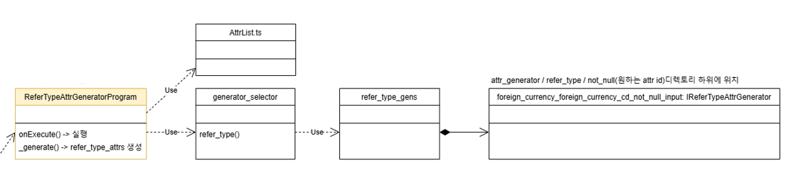
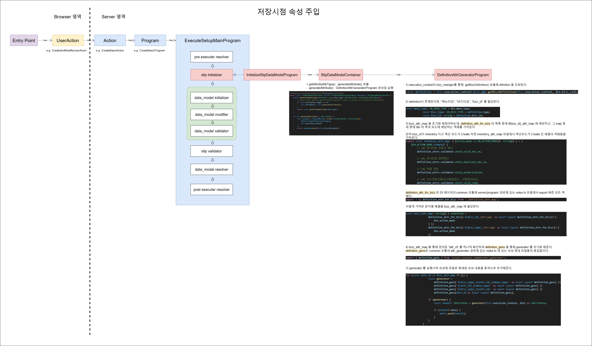

# Daily Retrospective

**작성자**: [박주현]  
**작성일시**: [2025-02-11]

---

# 1. 오늘 배운 내용

할당 받은 JOB 을 통하여 저장 시점시 속성 주입하는 과정과 수경님을 도와드리면서 SETUP 호출시 속성이 주입되는 과정을 보며 차이점을 이해했습니다.

유저액션을 크게 나누면 2가지로 구분 될 수 있습니다.
(1) 메뉴를 눌러 화면에 진입시 화면 양식을 불러오는 행위(SETUP ACTION, DATA ACTION)
(2) 쓰기작업시 사용자의 넘긴 데이터를 DB 에 저장하는 행위(CRUD ACTION)

각각 행위에서 data_model 의 prop의 속성을 동적으로 주입할 수 있습니다.
오늘 2번 과정을 job으로 배정받아 정리를 하였고, 1번 과정은 수경님과 아날로그 디버깅을 하여 학습하였습니다.

## (1) 화면 양식을 불러오는 setup action 에서 속성 주입하기

외화코드실습시 setup을 하드코딩된 파일을 사용했기에 이는 경험하지 않았습니다.

따라서 5.0으로 변환된 재고쪽 로직을 참고하여 속성 주입을 살펴봤습니다.

일단 화면양식 api 호출시 제일 먼저 맞닿는 서버의 진입점을 봤습니다.
당연히 `GetInventorySetupAction` 을 살펴봤습니다.

메뉴 타입이 `Input` 일때 액션은 `GetInventoryInputSetupProgram` 을 호출하고 실행합니다.

```ts
case EN_MENU_TYPE.Input: {
				const program = ProgramBuilder.create<GetInventorySetupRequestDto, GetInventorySetupResultDto>(
					IGetInventoryInputSetupProgram,
					execution_context
				);
				result = program.execute(data);
				break;
			}
```

<br>

`GetInventoryInputSetupProgram` 에서 속성을 generate 하는 곳을 살펴봤습니다.

```ts
const attr_program = ProgramBuilder.create<
  IAttrGeneratorProgramRequestDto,
  ISetup
>(IAttrGeneratorProgram, this.execution_context);
```

<br>

`AttrGeneratorProgram` 을 통해 속성을 generate 하는 걸 알았습니다.
`AttrGeneratorProgram` 에서는 실습때 TempExecuteSetupMainProgram 에서 했던 것과 같이 `ReferTypeAttrGeneratorProgram` 을 사용합니다.

`ReferTypeAttrGeneratorProgram`은 속성을 generator_selector 를 속성을 주입하는 것을 외화코드에서 실습을 하였습니다.

순서를 나열해보자면 다음과 같습니다.

```
GetInventorySetupAction -> GetInventoryInputSetupProgram -> AttrGeneratorProgram -> ReferTypeAttrGeneratorProgram -> 이후는 교육실습때 학습
```

`ReferTypeAttrGeneratorProgram` 이후 동작은 아래 그림과 같습니다.



<br>

## (2) 저장시점에서 속성 주입하기

저장 같이 쓰기 동작시에도 속성을 주입할 수 있습니다. 이때 속성주입은 `ReferTypeAttrGeneratorProgram` 에서 이뤄지지 않습니다.

이때 속성주입은 공통으로 사용하는 ExecuteSetupMian 프로그램의 "slip initializer" 단ㄱㅖ에서 이뤄집니다.

이 점의 차이는 1~2주 전 현우팀장님 공유해주신 지희 선임님의 지식 공유 자료를 보고 파악해서 팀장님께 여쭤봐서 학습을 했는데, 딱 job으로 배정돼서 진행이 수월했습니다.



<br>

위 그림에서 빨간 박스들이 속성 주입을 하는 주요 프로그램들입니다. "slip initializer" 단계에서 InitializeSlipDataModelProgram 을 통해 이뤄집니다.

`InitializeSlipDataModelProgram`은 `SlipDataModelContainer`을 활용해 generateAttribute() 함수를 호출해 속성을 주입합니다.

`DefinitionAttrGeneratorProgram` 을 통해 ${bizz_id}\_attr_map 에 비즈와 액션모드에 해당하는 속성들을 가져오고 이를 attr_id 기준으로 주입합니다.

---

# 2. 동기에게 도움 받은 내용

아리송한 부분들을 승준님과 이야기하며 개념을 다잡았습니다. 현철님께서 제가 모르는 5.0 도입된 업무나 디비 관련 부분을 도와주셨습니다.

---

# 3. 개발 기술적으로 성장한 점

## 3-2. 오늘 직면했던 문제 (개발 환경, 구현)와 해결 방법

건호님의 preset 구현을 도와주면서 새롭게 알게된 점이 있었습니다. preset 은 사용자 커스텀 양식과 같습니다. 기본 양식 옆에 작은 탭이 생겨야합니다. 진행 상태와 같이 menu - attributes 안에 정보를 하드 코딩하면 그 정보가 탭에 생기는 걸 알 수 있었습니다.

하지만 menu - attributes 안에 하드 코딩된 정보가 화면에 렌더링 되지 않았습니다.

이유를 유추했을 때 데이터를 넣어주는 부분을 있지만, 그 틀을 설정한 부분이 없어서 그렇다고 생각했습니다. fe부문의 한조 선임님께 화면 렌더링에 관하여 도움을 요청하였습니다.

결론적으로 틀을 설정하는 부분이 누락돼 나타나지 않는 게 맞았습니다. 헤더 부분이 빠진 것이 이유였습니다. `판매현황` 기준 헤더에 preset 관련 prop 이 없어서 필요없을 것이라 생각했는데, 그렇지 않았습니다.

`헤더`정보를 `view_container`에 선언해주고, prop_id를 잘 맞춰주니 화면에 렌더링된 걸 확인할 수 있었습니다.

---
