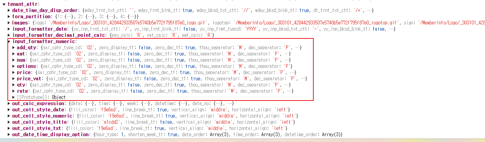

# Daily Retrospective

**작성자**: [허수경]  
**작성일시**: [2025-02-11]

# 1. 오늘 배운 내용 (필수)

## 숫자형 항목에 SC 설정값 적용하기

### SC 설정이란
- SC(Self-Customizing) 설정은 회사의 기본값을 정하는 설정입니다.
- 양식에서 따로 설정하지 않으면 회사의 SC 설정값을 따릅니다.
  - 예시: 금액 소수점 자리, 천 단위 구분 기호 등


### SC 설정 값은 어디에 저장될까?
- SC 설정값은 `execution_context.tenant.tenant_attr` 속성에 저장됩니다.
- 그 중 `input_formatter_numberic` 항목을 보면 위에서 설정한 숫자형항목에 대해 값을 들고 있는 것을 볼 수 있습니다.




### SC 설정 값을 언제, 어디서, 어떻게 generator를 할 수 있을까
| 구분  | 설명  |
|--------|------------------|
| **언제?** | Setup API 호출 시 |
| **어디서?** | (추가 확인 필요) |
| **어떻게?** | `basic_tf` 값을 기준으로 생성됨 |

- `basic_tf`란 
  - 기본값 여부를 나타내는 변수입니다.
  - 회사의 SC 설정값을 기본적으로 따르지만, 사용자가 직접 변경할 수도 있습니다.
    - 예시: 회사의 기본 금액 소수점 자리는 2자리지만, 사용자가 양식에서 4자리로 변경 가능
  - basic_tf = true이면, 기본값을 따른다는 의미입니다.
  - generator 실행 시, basic_tf가 true이면 SC 설정값을 context에서 가져와 속성을 생성합니다.

-  SC 설정값을 적용하는 코드 분석
  ```ts
  // discount_amt_value_format_in.ts
  if (_.vIsEquals(value_format.basic_tf, true)) {
    value_format.basic_tf = false;  // 왜 false로 설정하는지는 아직 잘 모르겠다.
    value_format.option = {
      thou_separator: execution_context.tenant.tenant_attr?.input_formatter_numeric?.options?.thou_separator,
      dec_separator: execution_context.tenant.tenant_attr?.input_formatter_numeric?.options?.dec_separator,
      zero_dec_tf: execution_context.tenant.tenant_attr?.input_formatter_numeric?.options?.zero_dec_tf,
      zero_display_tf: execution_context.tenant.tenant_attr?.input_formatter_numeric?.options?.zero_display_tf,
      decimal_part_size: execution_context.tenant.tenant_attr?.input_formatter_numeric?.amt?.decimal_part_size,
    };
  }
  ```
  - basic_tf가 true이면 SC 설정값을 적용합니다.
  - execution_context.tenant.tenant_attr.input_formatter_numeric에서 설정값을 가져와 value_format.option을 채웁니다.
  - basic_tf = false로 변경하는 이유는 아직 명확하지 않으므로 추가 확인이 필요합니다.


### 아직 해결 못한 궁금증
1. time_mange_input 페이지에서 SC 유효성 검증을 진행한 결과, 코드를 수정하지 않았음에도 이미 회사 SID 기준으로 숫자형 항목이 SC 설정을 가져오고 있었습니다.
요소를 확인해 보았으나, prop의 attribute에는 'display_state' 외에 다른 값이 존재하지 않았습니다.
(테스트 계정 게시판 숫자형항목을 찍어보았을 땐, 'max_length', 'value_format'이 존재하는 것은 확인했습니다.)
저는 어떤 값에 의해 generator가 실행되어 숫자형 항목에 속성을 들어간다고 이해했는데, 해당 요소에서 이를 확인할 수 없습니다. 속성이 없는데 어떻게 반영되고 있는지 궁금합니다.

2. 현재는 time_manage_input 페이지를 하드코딩한 setup 파일을 이용하여 화면을 불러오고 있습니다. 이 과정에서 generator가 호출되는 시점이 궁금합니다.
제가 이해하기로는 generator를 호출하려면 GetBasicInputSetupProgram을 통해 generator program을 호출해야 합니다. 하지만 하드코딩된 setup 파일을 사용할 경우 generator program이 실행되지 않을 것이라고 생각하고 있어 위와 같은 궁금증이 생겼습니다.

3. context에 SC 설정값을 담는데 타인이 SC 설정 값을 수정했다면, 내가 들고있는 context값도 동적으로 반영되는 것일까?

4. discount_amt_value_format_in.ts에서 basic_tf값이 true일 때, 왜 fasle로 바꿔주는지 궁금합니다.


## 2. 동기에게 도움 받은 내용 (필수)

- '선택삭제' 유효성 검사를 위해 UserAction 에서 작업을 해야했는데 담당하고 있는 도형님과 성재님께 도움을 받았습니다.
- 민준님께서 브라우저에서 setup 파일을 읽을 수 있는 방법을 알려주셨습니다.
- 주현님께서 generator의 흐름을 다시 한번 살펴봐주셨습니다.
- 현철님, 주원님께서 콘솔에 요소 정보를 출력하는 방법을 알려주셨습니다.
- 강민님께서 bizz_sid로 sc 설정을 부르는 것을 발견해주었고 또한 그 과정을 함께 찾아봐주었습니다.

---

# 3. 개발 기술적으로 성장한 점 (선택)

## 2. 오늘 직면했던 문제 (개발 환경, 구현)와 해결 방법

### `$$date` 컴포넌트 사용시 년도에 이상한 값 입력되는 버그

- FE 부문에 문의 드려 해결중입니다.


