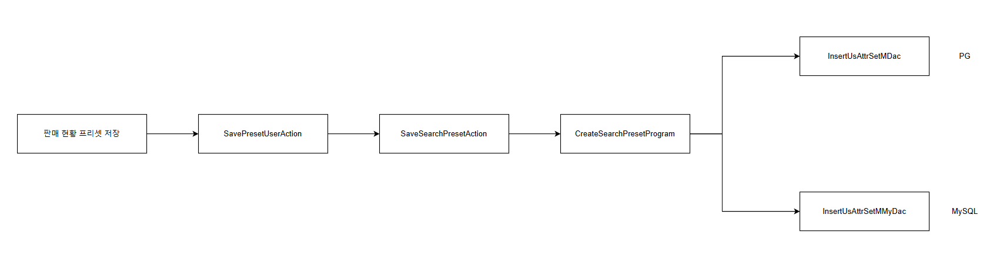
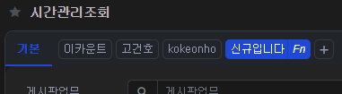
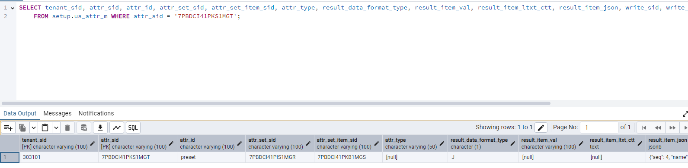
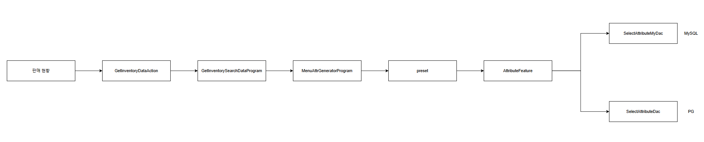

# Daily Retrospective

**작성자**: 고건호
**작성일시**: 2025-02-12

## 1. 오늘 업무 내용

<br>

현재 진행 중인 프리셋 관련 잡의 요구사항은 아래와 같습니다.

<br>

**1. setup에 프리셋 하드 코딩**

<br>

**2. 현재 프리셋을 어느 테이블에 저장/조회 하는지 확인**

<br>

**3. 시간관리업무, 시간관리이력업무의 프리셋을 해당 테이블에 저장할 수 있을지 확인**

<br>

**최종: 신규 프리셋 저장/수정 반영**

<br>

어제까지 `time_manage_list_setup.ts`에 프리셋을 하드 코딩하여 적용 여부와 프리셋 간 변환 여부를 확인했으니, 오늘 해야하는 업무는 2번부터 진행했습니다.

<br>

### 프리셋 저장/조회 테이블 확인

<br>

#### 저장

<br>

현재 5.0 신규 프리셋 저장 흐름을 나타낸 도식화입니다.

<br>



<br>

`CreateSearchPresetProgram` 내부에서 MySQL에 저장하는 Dac과 PostgreSQL에 저장하는 Dac이 생성됩니다.

`CreateSearchPresetProgram`은 아래와 같이 작성되어 있습니다.

<br>

```typescript
// CreateSearchPresetProgram.ts

import { util } from "@shared_usecase_common/@abstraction";
import { EN_BIZZ_TYPE, EN_MENU_TYPE, EN_RESULT_DATA_FORMAT_TYPE, EN_RESULT_TYPE } from "ecount.fundamental.define/enum";
import { $$sid } from "ecount.fundamental.define/type";
import { regexp } from "ecount.infra.base/util";
import { IExecutionContext } from "ecount.infra.bridge/base";
import { manager } from "ecount.infra.bridge/feature";
import { DacCommandBuilder } from "ecount.infra.common/dac";
import { program_impl } from "ecount.infra.common/decorator";
import { BaseProgram } from "ecount.infra.common/program";
import { SaveSearchPresetRequestDto } from "ecount.usecase.base/@abstraction";
import { ICreateSearchPresetProgram, SaveSearchPresetResponseDto } from "ecount.usecase.setup/@abstraction";
import {
  DeleteV3GwbdFormsearchUserDac,
  InsertUsAttrCondMDac,
  InsertUsAttrCondMMyDac,
  InsertUsAttrMDac,
  InsertUsAttrMMyDac,
  InsertUsAttrSetItemMDac,
  InsertUsAttrSetItemMMyDac,
  InsertUsAttrSetMDac,
  InsertUsAttrSetMMyDac,
} from "ecount.usecase.setup/dac";

/**
 * 검색 preset 저장 - 5.0 setup 개발되기 전 임시로 사용
 */
@program_impl(ICreateSearchPresetProgram)
export class CreateSearchPresetProgram
  extends BaseProgram<SaveSearchPresetRequestDto, SaveSearchPresetResponseDto>
  implements ICreateSearchPresetProgram
{
  constructor(execution_context: IExecutionContext) {
    super(execution_context);
  }

  onExecute(dto: SaveSearchPresetRequestDto): SaveSearchPresetResponseDto {
    const result = {
      max_seq: dto.max_seq,
      v5_key: {
        attr_set_sid: _.vMakeKey32(),
        attr_set_item_sid: _.vMakeKey32(),
        attr_sid: _.vMakeKey32(),
        attr_cond_sid: _.vMakeKey32(),
      },
    } as SaveSearchPresetResponseDto;

    const seq = !_.vIsEmpty(dto.preset.v3_key) ? dto.preset.data.seq : result.max_seq;
    dto.preset.data["bizz_sid"] = this.execution_context.action.bizz_sid;
    dto.preset.data["user_id"] = this.execution_context.session.user_sid;
    dto.preset.data["seq"] = seq;
    result.seq = _.vSafe(seq, result.max_seq);

    const attr_set_dac = DacCommandBuilder.create(InsertUsAttrSetMDac, this.execution_context);

    const attr_set_dac_my = DacCommandBuilder.create(InsertUsAttrSetMMyDac, this.execution_context);

    const definition_feature = this.execution_context.getFeature<manager.IBizzManager>(manager.IBizzManager);
    const definition = definition_feature.getBizzDefinition(
      this.execution_context,
      this.execution_context.action.bizz_sid
    );

    attr_set_dac.execute({
      attr_set_sid: result.v5_key.attr_set_sid,
      owner_set_type_01: "user",
      owner_set_id_01: regexp.replaceSpecialByType(this.execution_context.session.user_sid, "default"),
      owner_set_type_02: "bizz",
      owner_set_id_02: this.execution_context.action.bizz_sid,
      owner_set_type_03: "menu",
      owner_set_id_03: this.execution_context.action.menu_sid,
    });

    attr_set_dac_my.execute({
      attr_set_sid: result.v5_key.attr_set_sid,
      owner_set_type_01: "user",
      owner_set_id_01: regexp.replaceSpecialByType(this.execution_context.session.user_sid, "default"),
      owner_set_type_02: "bizz",
      owner_set_id_02: this.execution_context.action.bizz_sid,
      owner_set_type_03: "menu",
      owner_set_id_03: this.execution_context.action.menu_sid,
    });

    const attr_set_item_dac = DacCommandBuilder.create(InsertUsAttrSetItemMDac, this.execution_context);

    attr_set_item_dac.execute({
      attr_set_item_sid: result.v5_key.attr_set_item_sid,
      attr_set_sid: result.v5_key.attr_set_sid,
      owner_type_01: "prop",
      owner_id_01: "search_preset",
    });

    const attr_set_item_dac_my = DacCommandBuilder.create(InsertUsAttrSetItemMMyDac, this.execution_context);

    attr_set_item_dac_my.execute({
      attr_set_item_sid: result.v5_key.attr_set_item_sid,
      attr_set_sid: result.v5_key.attr_set_sid,
      owner_type_01: "prop",
      owner_id_01: "search_preset",
    });

    const attr_dac = DacCommandBuilder.create(InsertUsAttrMDac, this.execution_context);

    attr_dac.execute({
      attr_sid: result.v5_key.attr_sid,
      attr_id: "preset",
      attr_set_sid: result.v5_key.attr_set_sid,
      attr_set_item_sid: result.v5_key.attr_set_item_sid,
      result_sid: result.v5_key.attr_sid,
      result_data_format_type: EN_RESULT_DATA_FORMAT_TYPE.JSON,
      result_item_json: JSON.stringify(dto.preset.data),
    });

    const attr_dac_my = DacCommandBuilder.create(InsertUsAttrMMyDac, this.execution_context);

    attr_dac_my.execute({
      attr_sid: result.v5_key.attr_sid,
      attr_id: "preset",
      attr_set_sid: result.v5_key.attr_set_sid,
      attr_set_item_sid: result.v5_key.attr_set_item_sid,
      result_sid: result.v5_key.attr_sid,
      result_data_format_type: EN_RESULT_DATA_FORMAT_TYPE.JSON,
      result_item_json: JSON.stringify(dto.preset.data),
    });

    const attr_cond_dac = DacCommandBuilder.create(InsertUsAttrCondMDac, this.execution_context);

    attr_cond_dac.execute({
      attr_cond_sid: result.v5_key.attr_cond_sid,
      attr_sid: result.v5_key.attr_sid,
      priority_no: 999,
      cond_nm: "default",
      default_tf: 1,
      result_data_format_type: EN_RESULT_DATA_FORMAT_TYPE.JSON,
      result_type: EN_RESULT_TYPE.Direct,
      result_value: JSON.stringify(dto.preset.data),
    });

    const attr_cond_dac_my = DacCommandBuilder.create(InsertUsAttrCondMMyDac, this.execution_context);

    attr_cond_dac_my.execute({
      attr_cond_sid: result.v5_key.attr_cond_sid,
      attr_sid: result.v5_key.attr_sid,
      priority_no: 999,
      cond_nm: "default",
      default_tf: 1,
      result_data_format_type: EN_RESULT_DATA_FORMAT_TYPE.JSON,
      result_type: EN_RESULT_TYPE.Direct,
      result_value: JSON.stringify(dto.preset.data),
    });

    if (!_.vIsEmpty(dto.preset.v3_key)) {
      const v3_delete_dac = DacCommandBuilder.create(DeleteV3GwbdFormsearchUserDac, this.execution_context);

      v3_delete_dac.execute(_.vSafe(dto.preset.v3_key));
    }

    return result;
  }
}
```

<br>

최초에 `attr_set_sid`, `attr_set_item_sid`, `attr_sid`, `attr_cond_sid`를 UUID로 할당해주는 것을 확인할 수 있습니다.

해당 값들은 최종적으로 다시 Browser Layer로 내려줍니다.

신규 프리셋은 MySQL과 PostgreSQL의

- `us_attr_set_m`
- `us_attr_set_item_m`
- `us_attr_m`
- `us_attr_cond_m`

테이블에 저장됩니다.

<br>

`CreateSearchPresetProgram`에서 모든 Dac이 실행되고 나면 정상적으로 PostgreSQL에 저장된 값을 확인할 수 있습니다.

<br>



<br>



<br>

#### 조회

<br>

> 현재 `시간관리업무` 및 `시간관리이력업무`에서 프리셋 `조회`를 위해서는 `data_model` 코드가 작성되어야 하는데 작성되지 않아 신규 프리셋을 저장해도 가져올 수가 없는 상황입니다.
> 따라서 `판매 현황`에서 프리셋을 조회해오는 흐름을 도식화로 정리했습니다.

현재 5.0 기존 프리셋 조회 흐름을 나타낸 도식화입니다.

<br>



<br>

## 2. 동기에게 도움 받은 내용 (필수)

민준 님과 Browser Layer 디버깅을 함께 하면서 많은 것을 배울 수 있었습니다.
주현 님이 오늘 제가 setup에 프리셋 관련 하드 코딩을 할 때 놓친 부분이 있다는 것을 알려주셨습니다.
강민 님과 오후 4시에 3층에서 잠시 휴식을 취하며 분위기를 환기했습니다.
