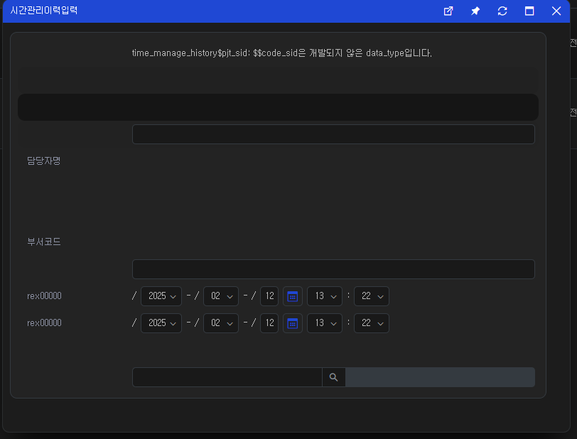

# Daily Retrospective

**작성자**: [김승준]  
**작성일시**: [2025-02-12]

## 1. 오늘 배운 내용 (필수)

-   `bizz_sid`, `menu_type`로 `data_model_id`를 가져와 `data_model_ definition`의 값을 넣어주었습니다.

```ts
const menu_data_model_info = this.execution_context.bizz_mgr.getMenuDataModelInfo(this.execution_context, dto.bizz_sid, dto.menu_type); // menu의 data_model 정보들을 가져옵니다.

const data_model_list = menu_data_model_info?.map((item) => item.data_model_id); // data_model_id 추출

data_model_list?.forEach((data_model_id) => {
    setup.data_model[data_model_id] = {};
    // data_model_id로 data_model_definition 가져옵니다.
    const data_model_definition = this.execution_context.bizz_mgr.getDataModelDefinition(this.execution_context, data_model_id);

    // 값 할당
    if (data_model_definition) {
        setup.data_model_definitions[data_model_id] = data_model_definition;
    }
});

// 가져온 definition의 refer_type들로 generator를 실행시킵니다.
ProgramBuilder.create<ISetup, ISetup>(IReferTypeAttrGeneratorProgram, this.execution_context).execute(setup);
```

## 2. 동기에게 도움 받은 내용 (필수)

오늘 하루 동안 동기에게 받았던 도움에 대해서 기록합니다.
지식 공유, 정서 케어 등 사소한 내용도 상관 없습니다.
최소 1인에게 어떤 도움을 받았는지에 대해 써주시면 되고, 여러 명을 쓰셔도 됩니다.

---

## 3. 개발 기술적으로 성장한 점 (선택)

아래의 3가지 주제 중 하나를 선택하여 작성합니다.

### 1. 교육 과정 상 배운 내용이 아닌 개인적 호기심을 해결하기 위해 추가 공부한 내용

### 2. 오늘 직면했던 문제 (개발 환경, 구현)와 해결 방법

-   만들어진 data_model 을 사용해 화면을 그리자 제대로 그려지지 않는 문제가 있었습니다.



-   data_model_template과 화면에 그려지는 것들을 확인해 문제점들을 찾았습니다.

| prop_id           | data_type           | toDo                |
| ----------------- | ------------------- | ------------------- |
| 1. pjt_sid        | $$code_sid          | display false       |
| 2. pjt_nm         | $$code_nm           | display false       |
| 3. pjt_cd         | $$code_cd           | display false       |
| 4. title          |                     | prop_name 추가      |
| 5. pic_nm         | $$code_nm           | display false       |
| 6. pic_cd         | $$code_nm           | display false       |
| 7. dept_nm        | $$code_nm           | display false       |
| 8. dept_cd        | $$code_cd           | display false       |
| 9. end_reason     |                     | prop_name 추가      |
| 10. job_start_dtm | rex0000 -> 시작일자 |
| 11. job_end_dtm   |                     | rex0000 -> 종료일자 |
| 12. board_data_nm |                     | display false       |
| 13. pjt_code      | $$code              | prop_name 추가      |
| 14. pic_code      | $$code              | display             |
| 15. dept_code     | $$code              | display             |

-   data_model_template을 위의 사항에 맞게 수정해주었습니다.

-   그러자 순서가 이상하게 나오는 것을 확인했습니다.

-   `03.ecount.usecase\ecount.usecase.timemanage\src\server\@abstraction\definition\time_manage_history\objects\master.ts`의 `target_props`에 존재하지 않고<br>
    `data_model_template`에 해당 prop에 `is_mandatory` 값이 true로 명시되어있지 않으면 data_model_definition으로 않았습니다.
-   또한 `target_props`에 없고 `is_mandatory`로 생성된 값은 배열의 맨 뒤로 들어간다는 것을 확인했습니다.

### 3. 위 두 주제 중 미처 해결 못한 과제. 앞으로 공부해볼 내용.

referTypeGenerator를 통해 가져오는 값과 지금 필요한 값을 비교해야 합니다.

가져오지 못하는 값을 어떻게 넣어줄지 (bizz_referType형식으로 넣어줄지, 하드코딩할지) 생각해 봐야 합니다.
