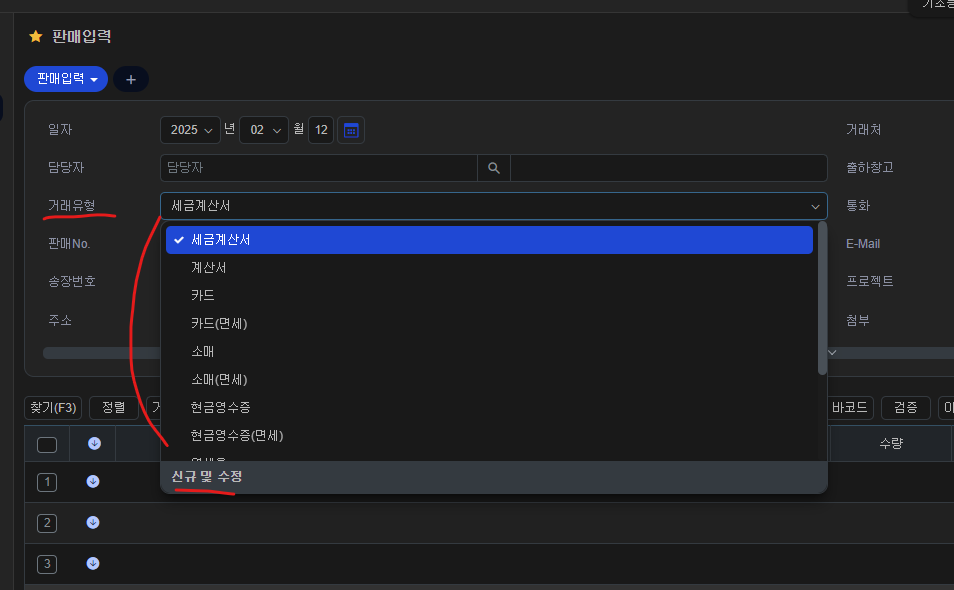

# Daily Retrospective

**작성자**: [박주현]  
**작성일시**: [2025-02-12]

---

# 1. 오늘 배운 내용

어제 속성을 주입해주는 gengerator 에 대해서 기술하였습니다.

```
유저액션을 크게 나누면 2가지로 구분 될 수 있습니다.
(1) 메뉴를 눌러 화면에 진입시 화면 양식을 불러오는 행위(SETUP ACTION, DATA ACTION)
(2) 쓰기작업시 사용자의 넘긴 데이터를 DB 에 저장하는 행위(CRUD ACTION)
```

속성을 넣어주는 프로그램을 앞으로 gengerator 이라 하겠습니다.

쓰기 작업은 `ExecuteSetupMainProgram `에서 Slip initializer 단계 에서 `DefinitionAttrGeneratorProgram` 이 gengerator로서 속성을 주입합니다.

setup action 과 data action은 각각의 inputSetupProgram 과 inputDataProgram 에서
`AttrGeneratorProgram` 를 통해 `ReferTypeAttrGeneratorProgram` 으로 속성을 주입합니다.

지금까지 내용을 정리하자면 속성주입은 3군데에서 일어난다고 할 수 있습니다.

**(1) 쓰기 연산시 ExecuteSetupMainProgram 에서 DefinitionAttrGeneratorProgram**

**(2) 화면 조회시 setup의 Get$$$InputSetupProgram 에서 ReferTypeAttrGeneratorProgram**

**(3) 화면 조회시 data의 Get$$$InputDataProgram 에서 ReferTypeAttrGeneratorProgram**

이렇게 정리하니 궁금증이 생겼습니다. 각각 속성 주입이 일어나는 이유가 뭐지? 한곳에서만 속성주입을 하고 다른 곳에선 안할 수 있지 않을까?

각각에서 속성을 주입하는 이유에 대해 궁금했고, 이에 대해 팀장님께 여쭤보면 차이를 학습했습니다.

## Setup 에서 ReferTypeAttrGeneratorProgram VS Data 에서 ReferTypeAttrGeneratorProgram

### 두 액션에서 모두 속성을 주입하는 이유

Setup 에서 ReferTypeAttrGeneratorProgram 을 전자, Data 에서 ReferTypeAttrGeneratorProgram을 후자라 칭하겠습니다.

전자에서도 속성 정보를 들고 오는데, 후자에선 왜 또 속성정보를 들고 오지 라고 할 수 있습니다.

이 궁금증의 이유는 캐싱에 있습니다. 저희가 setup 정보를 가져온 후 Redis 프로토콜을 사용하는 SSDB 에 캐싱하게 됩니다. 리스폰스 json 양이 방대하기 때문이죠. 또한 셋업 정보의 수정이 빈번히 일어날 일이 적어, 캐싱 데이터를 수정할 일 별로 없기 때문이죠.

Setup 에서만 속성 정보를 들고 오고, Data 에선 속성 정보를 주입 안한다고 가정해보겠습니다.

판매 입력 페이지를 예시로 들겠습니다.



<br>

셋업 정보로 화면을 그리기 위한 모든 정보들이 셋업 api의 리스폰스인 json에 다 담겨서 화면에 렌더링 되고, 이 데이터를 캐싱되게 됩니다.

거래 유형 prop 을 보겠습니다. 거래 유형엔 자식 라벨인 세금계산서 및 계산서 등등이 모든 정보가 json에 있을 것입니다. 여기서 새로운 거래유형을 추가하기 위해 신규 및 수정을 했다고 가정해 봅시다. 신규로 `간편결제` 라벨을 추가한다고 해보겠습니다. 신규 저장을 해서 거래 유형 아래에 `우리 회사` 코드의 `판매` 업무의 `입력` 메뉴에서 `거래 유형` PROP 아래에 간편결제가 추가돼 DB에 저장 됐고 화면이 새로고침이 된다고 가정합니다.

이때 화면을 그리기 위해 셋업 ACTION이 다시 일어나는데, DB 조회가 아닌, 이미 한번 해둔 데이터를 기반으로 캐생된 데이터를 가져올 것입니다. 캐싱된 데이터는 아직 거래 유형에 간편결제가 추가가 안된 데이터 입니다.

이렇게 되면 사용자는 간편결제를 추가했지만 간편결제 없는 UI 를 보게 되고, 이는 사용자 경험 저해로 이어집니다.

이런 상황이 있기 때문에 SETUP 에서도 속성 정보를 주입하고, DATA 에서도 속성 정보를 주입하는 것입니다.
다시 아까 상황으로 되돌아 오겠습니다.

거래유형에 간편결제를 추가했습니다. 셋업은 캐싱 정보를 가져오고 DATA ACTION 도 실행됩니다. DATA ACTION은 서버까지오면서 DB조회까지 통해 거래유형 PROP 아래 간편 결제 라벨이 추가된 것을 읽고 이를 적절하게 가공해 json 응답을 보냅니다. 화면의 뼈대는 캐싱된 setup 정보를 통해 얻고, 새로 추가된 데이터는 새로 응답으로 받은 data action 리스폰스인 json에서 얻을 수 있습니다.

사용자는 바로 간편결제를 볼 수 있게 됩니다.

### 두 액션에서 ReferTypeAttrGeneratorProgram 차이

이렇게 되면 한가지 의문이 듭니다.

```
데이터를 하나 추가하거나, 수정했을 때 data action을 호출해 새로운 데이터 정보로 갈아끼워주는데, 모든 prop을 매번하면 너무 손해 아니야? 바뀐 것만 하고 싶은데?
```

실제로 이를 방지하기 위해 두 액션에서 동작하는 것이 조금 다릅니다. 둘 모두 `ReferTypeAttrGeneratorProgram` 사용하긴 합니다. 하지만 `ReferTypeAttrGeneratorProgram` 사용하기 위해선 앞서 말한 `AttrGeneratorProgram` 을 통한 호출이 선행되어야합니다. 이 때 차이점이 일어납니다.

먼저 간단하게 말하자면 setup은 모든 attr을 다 가져오고, data는 menu와 refer_type 의 attr 만 다 가져오게 됩니다.

예시로 5.0으로 컨버팅된 재고 쪽을 보겠습니다.

**GetInventoryInputSetupProgram**

```ts
const attr_program = ProgramBuilder.create<
  IAttrGeneratorProgramRequestDto,
  ISetup
>(IAttrGeneratorProgram, this.execution_context);

attr_program.execute({
  setup: setup,
  generator_type_list: [
    EN_GENERATOR_TYPE.BIZZ,
    EN_GENERATOR_TYPE.FUNCTION,
    EN_GENERATOR_TYPE.MENU,
    EN_GENERATOR_TYPE.TENANT,
    EN_GENERATOR_TYPE.USER,
    EN_GENERATOR_TYPE.DEFINITION,
  ],
});
```

generator_type 으로 모든 것을 넣고 있습니다.
generator_type 타입에 대해 아리송하다면 setup 파일 보겠습니다.
json 형식같이 엄청 많은 depth 로 이뤄져있지만, 최상위 키 들만 뽑아보겠습니다.

```ts
tenant: {} as ITenant,
user: {} as IUser,
bizz: {} as IBizz,
menu: { attributes: [{}], } as IMenu,
function: [] as IFunction[],
data_model: {} as IDataModelMapper,
data_model_definitions: {} as unknown as IDataModelDefinitionMapper,
```

키들이 어디서 많이 본 것 같지 않나요? 네 바로 GENERATOR_TYPE 입니다. 즉 셋업은 `ReferTypeAttrGeneratorProgram`을 돌릴 때 모든 타입의 속성들을 주입합니다.

**GetInventoryInputDataProgram**

```ts
const attr_program = ProgramBuilder.create<
  IAttrGeneratorProgramRequestDto,
  ISetup
>(IAttrGeneratorProgram, this.execution_context);
attr_program.execute({
  setup: setup,
  generator_type_list: [EN_GENERATOR_TYPE.MENU],
  attr_map: new Map([[EN_GENERATOR_TYPE.MENU, this.menu_attr_list]]),
});

// ... 두 작업은 함수로 분리 돼 있고 그 사이에 많은 로직들이 있습니다.

attr_program.execute({
  setup: setup,
  generator_type_list: [EN_GENERATOR_TYPE.REFER_TYPE],
  attr_map: new Map([[EN_GENERATOR_TYPE.REFER_TYPE, target_attrs]]),
});
```

Data 부분에선 위에서 보다싶이 GENERATOR_TYPE.MENU 와 GENERATOR_TYPE.REFER_TYPE 에 대해서만 속성 주입을 하고 있습니다.

그렇기 때문에 Data 쪽 속성 주입시엔 모든 타입의 속성정보를 for문 타지 않아도 되게 됩니다.

대표적인 예시로 시간관리현황검색에 `진행상태`를 보겠습니다.


진행상태를 그리기 위한 정보들은 data_model_definition 안에 props 와 attributes 에 항목 및 속성 정보들이 기입돼 있습니다.

하지만 `전체`, `확인` 라벨에 대한 정보들은 menu 키 안에 attrinbutes 안에 속성정보들이 들어 있습니다 이 menu 키 안 데이터들은 `판매 현황` 페이지 로드시 Data Action 의 응답 json을 참고했습니다.
즉 data action 의 응답으로 라벨을 동적으로 채워줍니다. 라벨을 새로 추가해도 Data Action 을 다시 호출할 테니 정상적으로 하나 추가된 라벨들을 볼 수 있겠죠?

## 쓰기 연산시 DefinitionAttrGeneratorProgram VS 화면조회시 ReferTypeAttrGeneratorProgram

`DefinitionAttrGeneratorProgram`, `ReferTypeAttrGeneratorProgram` 두가지 모두에서 속성을 주입하고 있습니다. 그렇다면 두 프로그램의 차이점은 뭘까요?

03 레이어 common 모듈의 arr_generator 디렉토리 안엔 타입 별로 디렉토리가 나눠져 있습니다. 여기선 두가지만 말하겠습니다.

첫번 째는 definition , 두번째는 refer_type

눈치 채셨겠지만, 이 디렉토리들은 바로 GENERATOR_TYPE 입니다. 그리고 `DefinitionAttrGeneratorProgram` 에선 definition 디렉토리 안에 있는 속성 파일을, `ReferTypeAttrGeneratorProgram` 에선 refer_type 디렉토리 안에 있는 속성 파일을 참조합니다.

여기서 각각 한개씩만 가져와 보겠습니다.

**definition**

```ts
export const account_amt_default_value: IDefinitionAttrGenerator<
  definition_attrs.pre_executer.initialize_account_details_array
> = (execution_context, slip_data_model) => {
  return {
    attr_id: definition_attrs.pre_executer.account_amt_default_value,
    attr_type: EN_ATTR_TYPE.PreExecuter,
    data: {
      resolver: IAccountAmtDefaultValueProgram,
    },
    prop_id: "",
  };
};
```

**refer_type**

```ts
export const apply_color: IReferTypeAttrGenerator<
  renderer_attrs.display_name
> = (execution_context, setup, target) => {
  return {
    prop_id: target.prop.prop_id,
    attr_id: renderer_attrs.color,
    attr_type: EN_ATTR_TYPE.Renderer,
    data: "primary",
  };
};
```

두 가지 로직의 차이점이 뭘까요? 바로 `prop_id` 가 있고 없음에 차이가 있습니다. `refer_type`은 target prop_id 가 있고, `definition`은 prop_id 가 비어있습니다.

`refer_type` 을 통한 속성 주입은 prop 의 refer_type을 통해 **prop에 각각의 attr 을 주입**하는 것이고,

`definition`은 **slip이 어떤 PreExecuter, validator, resolver를 쓸건지, 기본 명세에 속성을 추가**하는 것입니다.

추가된 PreExecuter, validator, resolver 등 속성들은 언제 쓰일 까요? 맞습니다. ExecuteSetupMainProgram 에서 Slip Initializer 단계 다음에 각각이 다 쓰입니다. 그렇기 때문에 DefinitionAttrGeneratorProgram 통한 속성주입이 Slip Initializer 단계에 일어나는 것입니다. 각각 PreExecuter, validator, resolver 등을 셋팅해주기 위함이죠.

## 번외) 양식 정보 및 속성파일

setup 공부를 하면서 이 얘기를 들었을 것입니다. **DB 에 저장되어 있는 셋업 정보와 파일로 명세된 속성 정보를 load_setup 에서 가져와 \_merge() 를 통해 하나의 setup 정보로 만들고 응답으로 반환한다.**

여기서 `DB 에 저장되어 있는 셋업 정보`, `파일로 명세된 속성 정보` 에 포커스를 맞춰보겠습니다.

1. DB 에 저장되어 있는 셋업 정보

   - 말그대로 DB 에 있는 셋업정보 입니다. `GetInventoryInputSetupProgram` 에서 V3FormAttributeSelectorFactory 라는 것이 있습니다.
   - V3FormAttributeSelectorFactory 는 5.0 DB 가 아닌 3.0 DB인 MYSQL 에서 양식 정보를 읽고 FEATURE 를 통해 5.0의 속성 양식처럼 컨버팅해줍니다.
   - 이 정보들은 회사가 설정한 속성 정보입니다. 즉 회사 바이 회사로 다른 정보들인 것이죠.
   - 이렇게 DB 에서 가져온 속성정보를 이카운트에선 `양식 정보`라고 통용합니다.

2. 파일로 명세된 속성 정보
   - Genetor 를 통해 주입한 속성 정보들입니다. 대표적으로 ReferTypeAttrGeneratorProgram이 있겠죠.
   - 왜 속성화 시켰을까요? 바로 이카운드에서 설정한 고정된 속성이기 때문입니다. 어느 회사이건 상관이 없습니다. 어떤 prop 에선 어떤 속성 정보를 꼭 주입할 거야라고 설정할 수 있을 겁니다.
   - 맞는 예시인지는 모르겠지만, 하나 들어보겠습니다. 우리는 DB 컬럼이 문자열 경우 VARCHAR 100으로 정해 뒀어. 그렇기 때문에 모든 "문자" refer_type 을 갖는 prop 들은 max_length 를 밸리데이션 하는 속성을 넣을 꺼야. 라고 할 수 있을 겁니다.

---

# 2. 동기에게 도움 받은 내용

수경님께서 자신의 회의 시간인데 제가 먼저 대신 팀장님께 여쭤볼 수 있도록 양보해주셨습니다.

---
