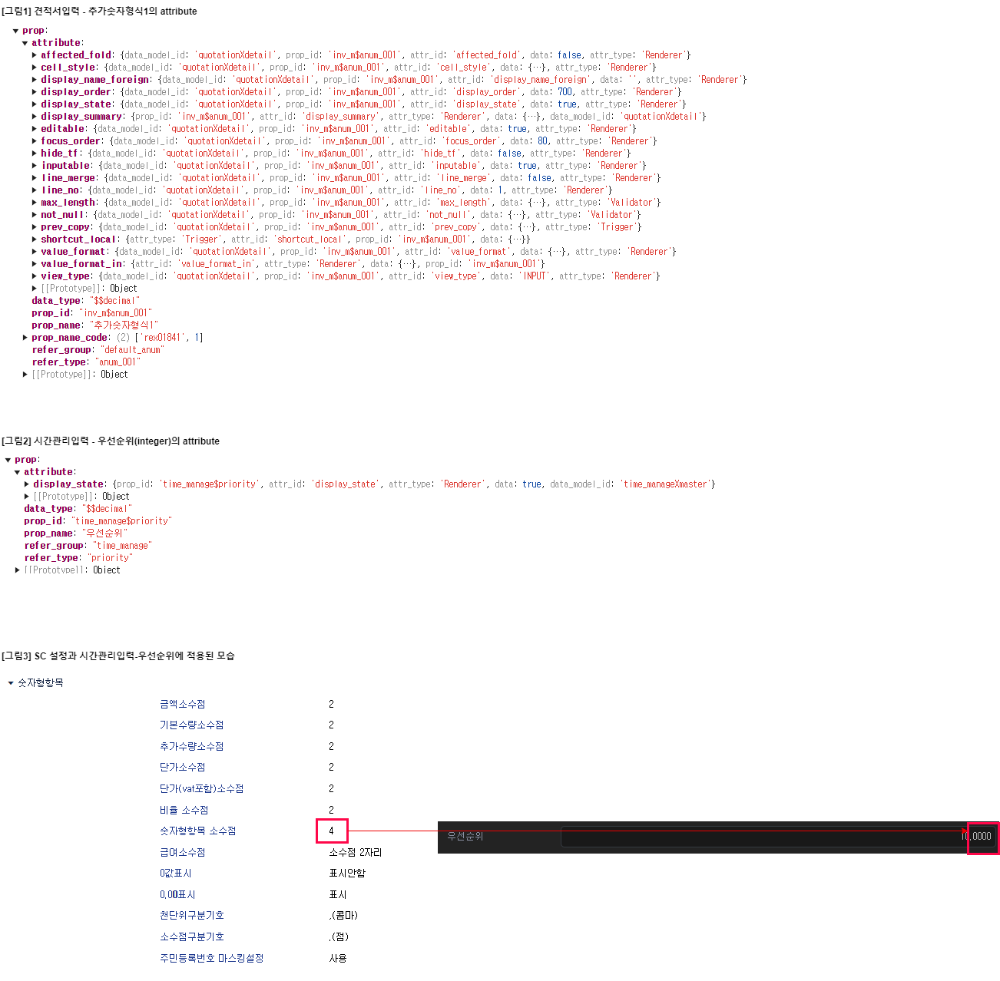
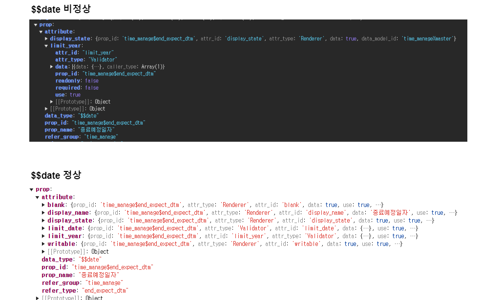

# Daily Retrospective

**작성자**: [허수경]  
**작성일시**: [2025-02-12]

## 1. 오늘 배운 내용 (필수)

### 속성이 없는데 어떻게 속성이 적용되는가

상황: SC 설정 중 숫자형 항목을 시간관리입력 페이지의 숫자형 항목에 속성으로 적용하려 합니다.
  - 기존 견적서입력 페이지의 추가숫자형식1 속성을 살펴보면, max_length, value_format, value_format_in 등의 SC 설정을 적용한 속성들이 존재합니다. ([그림1] 참고) 
  - 하지만 시간관리입력 페이지의 우선순위 속성에서는 위와 같은 속성이 없음에도 불구하고, ([그림2] 참고) 
  - SC 설정에 따른 표시 형식이 정상적으로 적용되고 있습니다.([그림3] 참고)
  - 속성이 내려오지 않음에도 불구하고 정상적으로 동작하는 이유가 궁금했습니다.

  

위에 대해 FE팀으로 받은 답변입니다.

```
attribute에 추가를 안했는데 정상적으로 동작되는 경우는 없습니다!
분명 어디선가 넣어주고 있을거에요 넣어주는 포인트는 value_format을 실행할 때나 value_format resolve를 할 때 한번 디버깅 해보시면 될 것 같습니다
```

따라서 `number_formatter`를 살펴보니, 실제로 값을 변환해주고 있는 로직이 보였습니다.
이제 콜스택을 따라 `number_formatter`를 누가 실행시켜주고 있는지를 보았더니, 순서는 아래와 같습니다.

이 답변을 바탕으로 `number_formatter`를 살펴보니, 실제로 값을 변환해주는 로직이 존재했습니다.
콜스택을 따라 누가 `number_formatter`를 실행시키는지를 추적해본 결과, 실행 흐름은 다음과 같았습니다.


1. 입력페이지에서 숫자형 항목에 입력시 input.tsx에서 이벤트를 발생시킨다(onFocus, onChange...)
2. 데이터 타입에 맞는 resolver 실행
    - 숫자형의 경우 → `number$$$$edit_value_format_resolver` 실행
    - `getNumTenantAttr` 함수에서 tenant가 가지고 있는 SC 설정 항목을 가져와 option에 담는다.

```
const getNumTenantAttr = (
	execution_context: IExecutionContext,
	refer_type?: string,
	refer_group?: string,
	menu_type?: EN_MENU_TYPE
): numeric_value_formatter => {
	const tenant_attr_id = `${menu_type === EN_MENU_TYPE.Input ? 'input' : 'out'}_formatter_numeric`;
	const tenant_attr = (execution_context.tenant.tenant_attr as any)?.[tenant_attr_id];

	if (tenant_attr?.[refer_type as string]) return tenant_attr[refer_type as string];

	if (tenant_attr?.[refer_group as string]) return tenant_attr[refer_group as string];

	return tenant_attr?.['num'];
};
```
  - SC 설정 - 숫자형 항목은 input_formatter_numeric 이라는 키로 context에 저장되어 있습니다.

3. `number_formatter`에서 앞서 option에 담긴 설정항목들에 대해 변환 작업을 실행합니다.

```
// 정수부 구분기호 적용
if (thou_separator && !options.use_percent) {
  integerPart = integerPart.replace(/(\d)(?=(\d{3})+(?!\d))/g, `$1${thou_separator}`);
}
```

#### 결론
```
SC 설정 속성이 직접 주입되지 않더라도,
→ 입력할 때마다 formatter가 동작하면서 실시간으로 값을 변환해주고 있었다.

현재는 하드코딩된 setup 파일을 사용하여 generator가 실행되지 않으므로,
→ 속성이 주입되지 않고 formatter를 통해 SC 설정이 적용되고 있는 상황이다.

그러나 InputSetupProgram 또는 InputDataProgram을 실행하여
→ generator를 통해 속성이 주입되면
→ 기존 견적서입력 페이지처럼 속성이 포함된 상태로 동작하게 될 것이다.
```

따라서 어제의 궁금증에 대한 답변을 해보자면,

```
1. time_mange_input 페이지에서 SC 유효성 검증을 진행한 결과, 코드를 수정하지 않았음에도 이미 회사 SID 기준으로 숫자형 항목이 SC 설정을 가져오고 있었습니다.
요소를 확인해 보았으나, prop의 attribute에는 'display_state' 외에 다른 값이 존재하지 않았습니다.
(테스트 계정 게시판 숫자형항목을 찍어보았을 땐, 'max_length', 'value_format'이 존재하는 것은 확인했습니다.)
저는 어떤 값에 의해 generator가 실행되어 숫자형 항목에 속성을 들어간다고 이해했는데, 해당 요소에서 이를 확인할 수 없습니다. 속성이 없는데 어떻게 반영되고 있는지 궁금합니다.
```

- genertator가 실행된 것이 아닌 formmter가 실행되면서 숫자형의 천단위구분기호, 소수점구분기호 등 값을 변환해주고 있었습니다.

```
2. 현재는 time_manage_input 페이지를 하드코딩한 setup 파일을 이용하여 화면을 불러오고 있습니다. 이 과정에서 generator가 호출되는 시점이 궁금합니다.
제가 이해하기로는 generator를 호출하려면 GetBasicInputSetupProgram을 통해 generator program을 호출해야 합니다. 하지만 하드코딩된 setup 파일을 사용할 경우 generator program이 실행되지 않을 것이라고 생각하고 있어 위와 같은 궁금증이 생겼습니다.
```

- 마찬가지로 generator가 실행되는 것이 아니기에 하드코딩된 setup 파일을 사용할 경우 generator program이 실행되지 않는 것이 맞습니다.

## 2. 동기에게 도움 받은 내용 (필수)

- 주현님, 강민님, 현철님, 승준님께서 FE팀으로부터 받은 답변을 이해할 수 있도록 도와주셨습니다. 특히, 주현님께서 같이 디버깅을 해보며 어디서 호출하고 어디서 값을 얻어오는지 도와주셨습니다.
- 주원님께서 맛있는 휘낭시에를 제공해주셔서 힐링을 할 수 있었습니다.
- 민준님께서 제가 작업해 할 부분에 대해 어떤 분께 요청드리면 될지 알려주셨습니다.

---

## 3. 개발 기술적으로 성장한 점 (선택)

### 2. 오늘 직면했던 문제 (개발 환경, 구현)와 해결 방법

#### `$$date` 컴포넌트 사용시 년도에 이상한 값 입력되는 버그

**문제 상황**

- 어제 발생한 버그를 처음에는 컴포넌트 자체의 문제라고 판단하여 FE팀에 문의하려 했습니다.
- 그러나 오늘 브랜치를 새로 받고 같은 상황을 다시 재현해 보니, 어제와 같은 문제가 발생하지 않았습니다.
- 이를 통해 컴포넌트의 버그가 아닌, 우리의 setup 코드에 문제가 있다는 점을 확인했습니다.

**문제 해결 과정**

1. 컴포넌트의 문제인지 확인하기 위해 Storybook에서 테스트해 보았고, 정상적으로 동작하는 것을 확인했습니다.
2. Storybook에서 사용한 속성을 time_manage_input_setup 파일에 추가해 보니, 정상적으로 동작하는 것을 확인했습니다.



- 아마 비정상일 때는 `blank`, `limit_date`, `writable`와 같은 속성이 없어서 이상한 값으로 들어간 것이 아닐까 추측합니다.

**배운 점**

- 이 경험을 통해 컴포넌트 사용 시 속성을 올바르게 설정하는 것이 매우 중요하다는 점을 배웠습니다.
  단순히 문제가 발생하면 컴포넌트의 버그라고 단정 짓기보다, 환경을 새로 세팅하고 문제를 재현해 보면서 원인을 분석하는 과정이 필요하다는 점을 깨달았습니다. 또한, 이상이 있을 때에 storybook를 보면서 코드의 문제인지, 컴포넌트의 버그인지 먼저 확인을 해야겠다는 것을 배웠습니다.

---

## 4. 소프트 스킬면에서 성장한 점 (선택)

주현님과 함께 브라우저 시점에서 디버깅을 진행하며 콜 스택을 활용해 함수가 어디에서 호출되고, 값이 어디에서 전달되는지를 추적하는 방법을 배웠습니다.
이를 통해 코드가 실행되는 순서를 논리적으로 따라가며 시스템이 동작하는 방식을 더 깊이 이해할 수 있었습니다.
앞으로는 단순히 기능을 구현하는 것을 넘어, 내부 로직을 명확히 파악하며 개발하는 습관을 기르고자 합니다.
