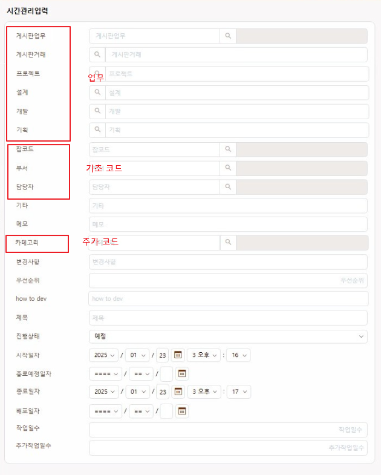
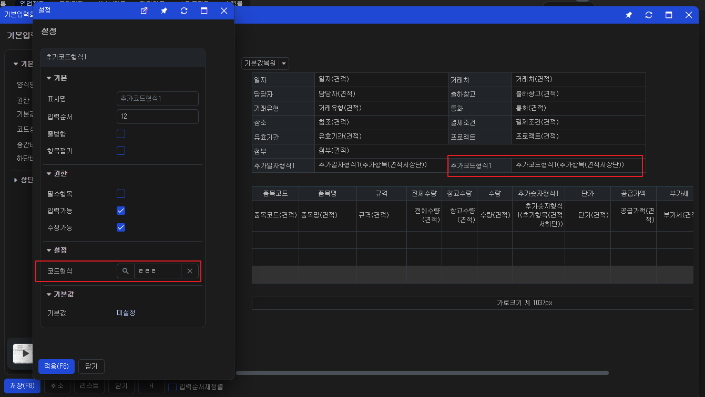

# Daily Retrospective

**작성자**: [황주원]  
**작성일시**: [2025-02-12]

## 1. 오늘 배운 내용 (필수)
### 코드 유효성 체크 (삭제된 코드, 사용중단 코드)
`check_valid_code` 를 실행해야 하는데 해당 validator 는 전표에 대한 유효성 체크이기 때문에 
`ValidateSlipDataModelProgram` 프로그램을 통해 실행됩니다.

1. ExecuteMainSetupProgram > ValidateSlipDataModelProgram 실행
2. time_manage_history_attr_map 에 명세한 check_valid_code 실행
3. check_valid_code에 명세된 CheckValidCodeProgram 실행 
4. 해당 프로그램에서 master, detail > data model id 가져오기
5. `CodeTypeValidatorFeature` 실행

#### CodeTypeValidatorFeature
로직이 굉장히 복잡해 분석한 부분은 아래와 같습니다.

1. initMap
    1-1. data model로 정의된 항목들 중 data 타입이 `$$code` 인 항목을 가져옵니다.
    ```ts
    if (this.code_props_set.has(data_model_id) == false) {
        this.code_props_set.set(data_model_id, new Set(data_model_container.getPropIdsByDataType($$code)));
    }
    ```
    1-2. 유효성체크 대상(기초코드)이 하드코딩으로 정의되어 있습니다.
    ```ts
    // 유효성체크 대상 코드타입 리스트 propid
    const setting_targets = new Set([
        'cust',
        'prod',
        'wh',
        'pic',
        'manage_item',
        'account',
        'pjt',
        'dept',
        'deliver_dept',
        'referrer_dept',
        'sharer_dept',
        'deliver',
        'sharer',
        'referrer',
        'corresponding_cust',
        'corresponding_account',
    ]);
    ```
    1-3. 1-1 에서 가져온 항목들을 하나씩 돌면서 1-2에 정의된지 확인합니다.
    ```ts
    const refer_type = data_model_container.getReferTypeByPropId(x) as string;
    const refer_group = data_model_container.getPropGroupIdByPropId(x);
    // 설정으로 사용여부를 판단하는 항목들
    if (setting_targets.has(refer_type)) {
        return _.vContains(Object.keys(this.target_code_keys), refer_type);
    }
    ```
    1-4. 이후 로직을 정확히 파악하진 않았지만 유효한 전표인지 확인하는 로직이 들어가게 됩니다.

#### 형식
현재 세 가지 유형으로 코드 형식이 나뉘게 됩니다. 



1. 업무
    > 메뉴에서 정의된 것 처럼 업무가 다른 업무를 관리하는 부분
2. 기초코드
    > 이카운트에서 기초코드로 관리하는 부분
    위 1-2 처럼 해당 기초 코드는 공통으로 사용하는 부분이라 거의 하드코딩으로 정의된 것 같다.
3. 추가코드
    추가코드형식은 양식설정을 통해 설정할 수 있습니다. <br />
    해당 형식에 대한 코드는 직접 설정할 수 있으며 그 코드 항목의 값을 불러옵니다.
    

## 2. 동기에게 도움 받은 내용 (필수)
* 민준, 도형, 주현님께서 디버깅을 도와주셨습니다. 감사합니다.
* 수경님께서 5.0 개념 중 기초코드 관련해서 이해가 안 되는 부분을 알려주셔서 감사합니다.
* 건호님께서 '주마가편' 이라는 사자성어를 알려주셨습니다. 지식 + 1 감사합니다...
    * 주마가편이란 '달리는 말에 채찍질한다' 라는 의미입니다.


---

## 3. 개발 기술적으로 성장한 점 (선택)

### 2. 오늘 직면했던 문제 (개발 환경, 구현)와 해결 방법
#### CodeTypeValidatorFeature datamodel prop 못 가져오는 현상
아래 로직이 수행되었을 때, $$code 로 가져오는 항목이 pjt 밖에 없었습니다.
```ts
if (this.code_props_set.has(data_model_id) == false) {
    this.code_props_set.set(data_model_id, new Set(data_model_container.getPropIdsByDataType($$code)));
}
```
pjt 일 때는 validator를 탔지만, 담당자 & 부서일 때는 타지 않았습니다.

먼저 data model template, setup 정보가 달라 수정했지만, 여전히 가져오지 않았습니다.

디버깅을 해보며 data model 을 가져오는 곳 : master, <br />
object > master.ts에 정의되어 있는가 ? -> X 

현재 `master.ts`에서 prop 을 정의하고 있는데, 해당 항목들이 빠져있던 것이 문제였습니다. <br />

해당 항목을 넣으니 전표 없음 팝업이 정상적으로 불러오는 것을 확인했습니다. <br />
다만, 현재 menu 쪽 definition, prop이 정상적으로 불러오지 않는 현상은 승준님께 공유했으며 해결되었을 때 다시 한 번 확인해 볼 것입니다.


### 3. 위 두 주제 중 미처 해결 못한 과제. 앞으로 공부해볼 내용.
* esql 로 실행이 되지 않고 fetch - creator 를 사용해서 구현한 부분이 있었습니다. 테이블은 정의되어 있는데, 해당 코드가 동작되는 sql문 정의된 부분을 파악하지 못했습니다. 일정관리가 끝나고 시간 여유가 된다면 해당 로직을 파악해 보고 싶습니다.

---

## 4. 소프트 스킬면에서 성장한 점 (선택)
- 하루종일 디버깅을 하다보니 디버깅 실력이 조금 는 것 같습니다. 

