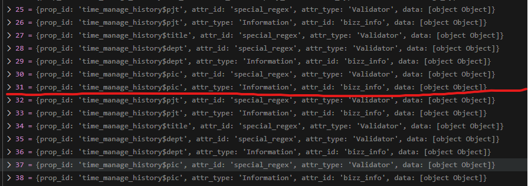

# Daily Retrospective

**작성자**: [김승준]  
**작성일시**: [2025-02-13]

## 1. 오늘 배운 내용 (필수)

-   generator 통해 속성값을 가져오기 위해 필요한 generator를 생성하고 AttrList에 매핑값을 추가해주었습니다.

`AttrList.ts`

```ts
export const refer_type_attr_map: { [refer_type: string]: { [menu_type in EN_MENU_TYPE]?: string[] } } = {
    ...
	end_reason: {
		[EN_MENU_TYPE.Input]: [validator_attrs.max_length, validator_attrs.special_regex],
	},
}
```

`03.ecount.usecase\ecount.usecase.common\src\server\attr_generator\refer_type\` 위치에 `time_manage_history_end_reason_max_length`, `time_manage_history_end_reason_special_regex`을 생성해주었습니다.

## 2. 동기에게 도움 받은 내용 (필수)

-   **건호님**이 깃 오류가 생겼을 때 도움을 주었습니다.
-   **현철님**이 어떤 trigger에 어떤 userAction을 사용해야하는지 알려주셨습니다.
-   오류가 생겨 확인하지 못하는 부분을 **주현님**이 대신 확인해주셨습니다.

---

## 3. 개발 기술적으로 성장한 점 (선택)

아래의 3가지 주제 중 하나를 선택하여 작성합니다.

### 1. 교육 과정 상 배운 내용이 아닌 개인적 호기심을 해결하기 위해 추가 공부한 내용

### 2. 오늘 직면했던 문제 (개발 환경, 구현)와 해결 방법

-   

동일한 속성이 반복해서 들어가는 문제가 있었습니다.

```ts
private _getDataModelDefinition(dto: GetSetupRequestDto, setup: ISetup) {
    ...
		data_model_list?.forEach((data_model_id) => {
			setup.data_model[data_model_id] ??= {};
			const data_model_definition = this.execution_context.bizz_mgr.getDataModelDefinition(
				this.execution_context,
				data_model_id
			);

			if (data_model_definition) {
				setup.data_model_definitions[data_model_id] = data_model_definition; // copy by reference
			}
		});
	}
```

```ts
if (data_model_definition) {
    setup.data_model_definitions[data_model_id] = _.vCloneDeep(data_model_definition); // copy by value
}
```

-   `AttrList.ts`에 속성이 매핑되어있지만 속성값을 넣어주지 못하는 문제가 있었습니다.

```ts
	pic: {
        [EN_MENU_TYPE.Input]: [trigger_attrs.multi_user_action],

```

-   매핑값은 공통으로 사용되지만 generator는 공통으로 사용하지 않는다는 것을 확인했습니다.
    -   `time_manage_history_pic_multiuser_action` 을 만들어 주었습니다.

### 3. 위 두 주제 중 미처 해결 못한 과제. 앞으로 공부해볼 내용.

-   time_manage_input에서는 title이 not_null속성을 가져야 합니다. 하지만 AttrList에는 title의 not_null 항목이 매핑되어있지 않습니다.<br> title의 경우 매우 많은 곳에서 쓰이기 때문에 매핑을 추가하게 될 경우 많은 기능에 영향이 갈 수 있습니다.
-   AttrList에 매핑값을 추가하지 않고 generator에 추가하는 방법을 찾아보았습니다. 하지만 하드코딩하는 형식외에는 확인하지 못했습니다.
-   하드코딩 하지 않고 다른 기능에 영향이 가지않게 generator에 추가하는 방법을 공부하고 싶습니다.
