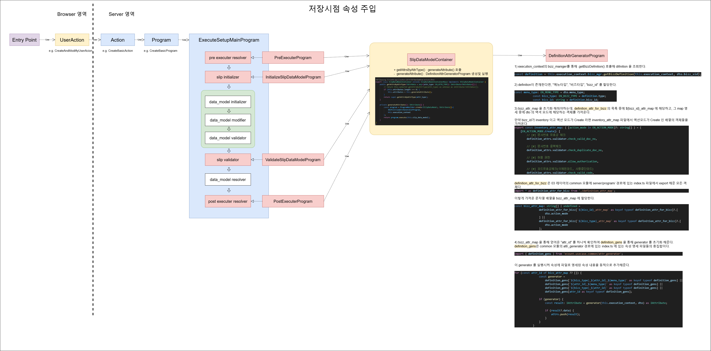
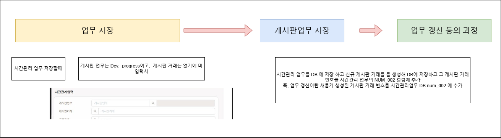

# Daily Retrospective

**작성자**: [박주현]  
**작성일시**: [2025-02-13]

---

# 1. 오늘 배운 내용

어제까지 정리한 내용 중에 틀린 내용이 있어서 수정을 했습니다.
ExecuteSetupMain 에서 속성을 주입할땐 Slip Initializer 단계에서 일어나는 것이 아니라 각 단계에서 다 일어납니다. 총 4 단계에서 일어납니다.

 

1. "저장시점" 의 돌아가는 ExecuteSetupMain 에서 속성주입은 pre*executer, validator, post, initializer, 등의 속성을 주입합니다. 이는 속성을 주입 당하는 주체가 slip 이라고 생각합니다. 제가 말한 슬립은 전표 그 전체입니다. 견적서 저장으로 예시를 들면 그 안에 quotationXmaster, quotationXdetail, quotationXnotification*?? 3개의 data_model_id 가 생긴다고 하면 이들을 묶은 전체가 slip 이자 담긴 것이 smc 입니다.
   이 전표를 저장하기 위해 pre 프로그램을 돌려야하고, validate 를 해야하고, post 작업을 해야하기 위해서 DefinitionAttrGenerator 로 각 단계에 속성을 주입해야 합니다.

2. 그럼 1번에 이어 저희는 slip initializer 단계를 지나 dmc 별로 초기화, 모디파이어, 밸리데이트를 합니다. 이때 dmc 별이 data*model_id 별이 맞고, 위 예시로 quotationXmaster, quotationXdetail, quotationXnotification*?? 이 해당하면 dmc 가공 작업이 3번이 돌게 됩니다.

3. 2번에 이어서 ReferTypeGenerator 를 지금 저희는 써야합니다. 러프 하게 보면 ReferTypeAttrGenerator 를 활용하면 data_model 당 prop 당 attr 를 전부 추가해줄텐데 slip 저장 관점에서는 이런 과정이 필요없다고 생각했습니다. 그래서 막연하게 ReferTypeGenerator로 속성을 주입해야하는지 의문이 생겼다가, 그래도 prop 중에 밸리데이션을 거쳐야하는 항목이 있을테고, data_model validator 단계에서 밸리데이션을 하기위해 속성을 주입한다고 생각했습니다.

4. ExecuteSetupMain을 보면 ReferTypeAttrGenerator 을 활용하고 있지 않습니다. 이는 견적서 저장 등 재고 쪽에 관한 모든 양식 정보들이 DB화 되어 있어서 필요없고, 저희는 속성 파일을 하드코딩해 ReferTypeAttrGenerator로 속성 주입하기 위함입니다.

5. 만약 캐시를 통해서 속성 주입이 가능하다면, 그리고 저장시점에 저희 셋업 화면에 이미 data_model에 속성 명세가 다 되어 있다면, ReferTypeGenerator 로 속성주입을 할 필요가 없다고 생각했습니다. 캐시에서 속성을 받아 selector 가 들고 있기 때문입니다. 하지만 캐시에서 가져온 것보다 하드코딩 된 정보를 가져오는 것이라 ReferTypeGenerator은 필요하게 됩니다.

6. ReferTypeAttrGenerator 구현 방법에 대해서 만약 앞으로 자주 쓰일 일이 있다면, 그냥 ReferTypeAttrGenerator 객체를 생성해, execute 하는 것이 아니라 다른 방법을 생각했습니다.
   ExecuteSetupMain은 GeneratorProgram을 다이렉트로 의존하는 것이 아니라 SlipDataModelContainer 를 통해 의존하고 있습니다. SlipDataModelContainer은 getAttrsByAttrType() 만을 가지고 있는데, getAttrsByReferType() 을 새로 만들어 SlipDataModelContainer을 의존해 제너레이터를 생성하게 하려고 합니다.
   두번째로 getAttrsByAttrType(), getAttrsByReferType() 두개가 되면, ProgramBuilder.create() 로 DefinitionAttrGeneratorProgram, ReferTypeAttrGeneratorProgram 을 각각 생성해 execute 하는 것이 아니라 AttrGeneratorProgram 을 생성해 여기서 GENERATOR_TYPE 을 넣어줘서 각각의 generator 를 실행시킬 수 있다고 생각합니다. 팀장님께서도 이방향이 옳고, 좋다고 하셨지만, 자주 쓰일일이 없기에 즉 전제가 틀렸기에 그냥 ReferTypeAttrGenerator 객체를 생성해 속성을 주입하려고 합니다.

### 기능 명세에 모호한 점을 학습

앞으로 job 은 밀어주기입니다. 시간관리 업무 저장을 할 때 게시판 거래도 새롭게 저장되기에 이 로직을 구현해야합니다.

---

# 2. 동기에게 도움 받은 내용

디버깅이 안되는 문제를 주원님이 찾아주셨습니다. attr 목록에 대해 수경님이 작업 중이신 내용과 일치하는 게 있는지 같이 봐주시면서 없다고 알려주셨습니다. 승준님이 옆에서 막히는 문제를 함께 봐주셨습니다.

---
