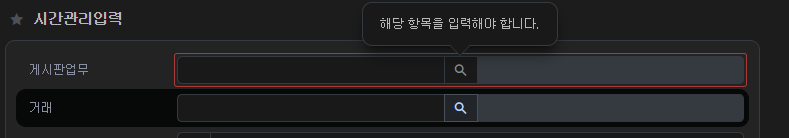

# Daily Retrospective

**작성자**: [허수경]  
**작성일시**: [2025-02-13]

## 1. 오늘 업무 내용

- 업무-거래 필수값 체크 (관련 기능명세번호: 4915)

### 1. 업무-거래 필수값 체크

#### 1.1 업무-거래 필수값 체크란

시간관리 입력 및 검색에서 거래는 반드시 업무에 종속됩니다. 즉, 업무 값이 입력되지 않으면 거래를 선택할 수 없어야 합니다.
<br>따라서, 업무 값 없이 거래를 선택하려 하면 "업무를 먼저 선택해주세요" 와 같은 안내 메시지를 띄우는 유효성 검사가 필요합니다.

#### 1.2 유효성 검사는 어디서 수행해야 할까?

거래를 선택하는 순간 즉시 유효성 검사가 이뤄져야 하므로, 거래의 UserAction 단에서 검사를 수행해야 합니다.
따라서 GetDynamicConnDataSearchUserAction에서 이 로직을 처리합니다.

### 2. 업무 값을 어떻게 가져올까?

업무 값을 확인하는 과정은 두 가지 단계로 나눌 수 있습니다.

1. 업무 항목(필드)의 존재 여부를 확인해야 함
2. 업무 항목의 실제 값을 가져와야 함

그러나 `GetDynamicConnDataSearchUserAction`은 거래에 대한 로직만 처리 하므로, 업무를 직접 하드코딩하는 것은 적절하지 않습니다.

이를 해결하는 방법은 두 가지가 있습니다.

1. 거래 UserAction을 호출할 때 `payload`로 `업무의 refer_type`을 넘긴다.

   - 거래 검색 시점에만 업무 값을 사용하도록 한다.
   - 거래 검색 시점에만 필요한 값 전달하기에 불필요한 속성을 유지하지 않아도 됩니다.

2. 거래 항목에 업무를 data로 넣어 속성으로 관리한다.

   - 거래 항목 내부에 업무 값을 유지한다.

제가 생각하는 더 나은 방법은 `payload`로 값을 넘겨주는 것입니다.
이유는, 거래 항목에 업무 값이 필요한 것은 거래를 검색할 때 뿐입니다. 따라서 계속 속성으로 들고 있을 필요없이, 거래를 검색하는 시점에 업무 값을 들고 있으면 된다고 생각합니다.

### 3. payload로 업무 값 전달하기

따라서, 거래 UserAction을 호출할 때 payload로 업무의 refer_type을 전달하는 방식을 적용합니다.

```ts
// setup
{
  prop_id: 'time_manage_s$bizz_data',
  attr_id: 'multi_user_action',
  attr_type: EN_ATTR_TYPE.Trigger,
  data: {
    add_codes: {
      identifier: 'IGetDynamicConnDataSearchUserAction',
      payload: { conn_refer_type: 'bizz_code' }, // 업무 refer_type 전달
    },
  },
}
```

### 4. payload가 누락된 경우 예외 처리

개발자가 `payload`로 `conn_refer_type`을 실수로 넘기지 않을 경우를 대비하여,
해당 값이 누락되었을 때 오류 메시지를 출력해야 합니다.

```ts
const conn_refer_type = payload?.options?.conn_refer_type;

if (_.vIsEmpty(conn_refer_type)) {
  // 개발자가 refer_type을 넘기지 않았을 때 에러 메시지 출력
  request.vmc.alert("payload error");
  return;
}
```

### 5. 업무 값을 조회하고 유효성 검사하기

이제 `conn_refer_type`을 활용해 실제 업무 값을 조회해야 합니다.
업무 값(`conn_data_sid`)을 가져오려면 `getValueByReferType`을 사용합니다.

또한, 업무 값이 없을 경우 사용자에게 **"업무를 먼저 선택해야 합니다."**라는 메시지를 띄워야 합니다.
이를 위해 `showError`를 호출합니다.

```ts
// GetDynamicConnDataSearchUserAction.ts
const conn_data_sid = (dmc?.getValueByReferType(conn_refer_type) as $$code)
  .code;
if (_.vIsEmpty(conn_data_sid)) {
  vmc.showError({
    dmc_id: dmc?.dmc_id as string,
    prop_id: conn_prop_id as string,
    attr_id: validator_attrs.not_null,
    data_model_index: 0,
    error_option: {
      error_message: $Resx.rex03609, //'해당 항목을 입력해야 합니다.'
      open_message_trigger: {
        direct: true,
      },
      clear_trigger: { focusout: true },
      clear_message_trigger: { mouseleave: true },
    },
    lazy: true,
  });

  return;
}
```



### 6. 거래 선택 시 업무 값 전달하기

사용자가 업무 값을 입력한 후 거래를 선택하면,
아래와 같은 로직으로 `GetConnDataSearchUserAction` 를 호출하면서 업무 값을 `payload`로 넘깁니다.

```ts
// 거래 코드 검색창 띄우는 로직
const result = await userActionExecutor.onDispatchActionAsync<
  { options: {} },
  IGetCodeUserActionResult
>(IGetConnDataSearchUserAction, {
  options: { conn_data_sid: conn_data_sid },
});
```

---

## 2. 동기에게 도움 받은 내용 (필수)

- 주원님, 강민님, 도형님과 함께 휴게 시간을 가지며 에너지를 충전할 수 있었습니다.
- 거래 UserAction 관련하여 현철님께서 진행 방식과 참고하면 좋을 부분을 조언해 주셨습니다. 생명이 1시간 연장된 느낌이었습니다.
- showError가 나타나지 않는 문제로 브라우저에서 디버깅을 진행했는데, 강민님께서 함께 원인을 찾아보며 해결 방안을 모색해 주셨습니다.

---

## 3. 개발 기술적으로 성장한 점 (선택)

### 3. 위 두 주제 중 미처 해결 못한 과제. 앞으로 공부해볼 내용.

거래용 UserAction을 호출할 때 payload에 refer_type 값이 없을 경우, 개발자에게 전달할 에러 메시지를 어떤 방식(팝업, 로그, showError 등등)으로 처리해야 하는지 궁금합니다.
