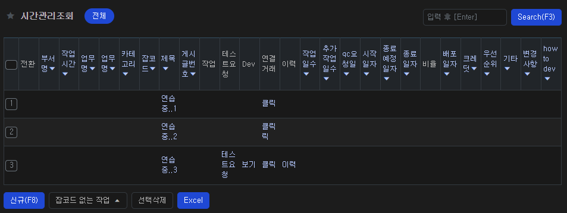
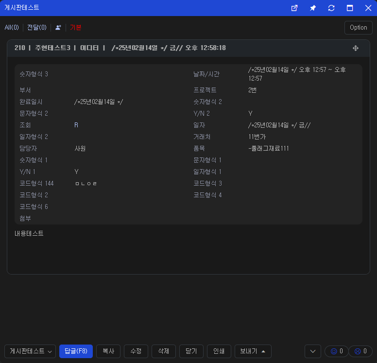
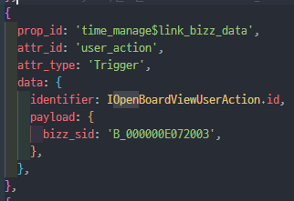
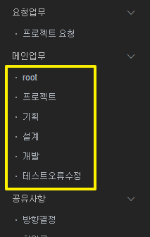

# Daily Retrospective

<br>

**작성자**: 고건호
**작성일시**: 2025-02-14

<br>

## 1. 오늘 업무 내용

<br>

- `연결 거래`에서 사용할 `UserAction` 생성

<br>

### `연결 거래`에서 사용할 `UserAction` 생성

<br>

현재 `시간관리업무` 조회 시 그려지는 화면은 다음과 같습니다.

<br>



<br>

`연결 거래`를 클릭하면 해당 `거래` 작성된 `게시판`의 화면을 띄워줄 수 있어야 합니다.

<br>



<br>

이를 위해 최초에는 `OpenBoardViewUserAction.ts`와 로직이 동일한 `OpenLinkBizzViewUserAction.ts`를 생성하고 `time_manage_list_setup.ts`의 `연결 거래` prop에 payload로 `bizz_sid`를 하드 코딩했습니다.

<br>



<br>

하지만 이 방식은 `연결 거래`가 하드 코딩된 특정 `bizz_sid`의 거래만 화면에 띄워줄 수 있으므로, 올바르지 않은 방식이었습니다.

<br>

`연결 거래`를 통해 다음의 `게시판 업무`에 접근할 수 있어야합니다.

<br>



<br>

따라서 조회 시 받아오는 `setup`의 `data_model`에 각 거래의 `bizz_sid`를 추출하는 방식으로 리팩토링 했습니다.

<br>

아래는 추가된 코드입니다.

<br>

```typescript
// OpenLinkBizzViewUserAction.ts

async function openPopup(
	execution_context: IExecutionContext,
	data_model_container: IDataModelContainer<any>,
	index: number,
	request: IBaseUserActionRequest<IOpenBoardViewUserActionPayload>,
	reciveHandler?: any
) {
	const refer_alias = request.payload.refer_alias;

	const bizz_sid_value = data_model_container.getValueByReferType<$$sid>(
		{ type: bizz_sid.id, alias: refer_alias },
		index
	);

  ...
```

<br>

이를 통해 `setup`에 `bizz_sid`를 하드 코딩하지 않고도 조회 시 가져온 여러 거래의 `게시판 업무`에 접근할 수 있게 됐습니다.

## 2. 동기에게 도움 받은 내용 (필수)

민준 님과 fiddler를 통해 패킷을 분석하며 즐거운 시간을 보냈습니다.

주현 님이 회사 ERD에서 현재 저희가 사용 중인 테이블을 열람하는 방법을 알려주셨습니다.
