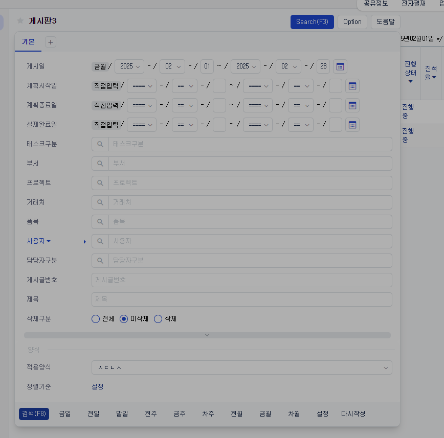
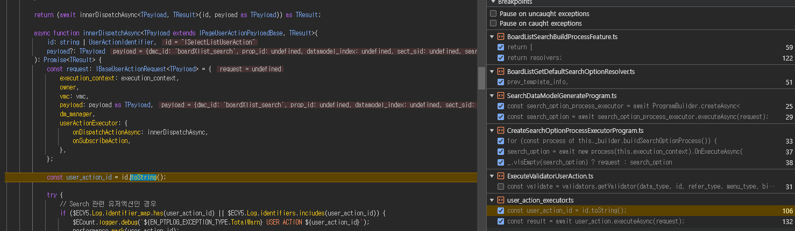

# Daily Retrospective

**작성자**: [나강민]  
**작성일시**: [2025-02-14]

## 1. 오늘 배운 내용 (필수)


```ts
@program_impl(ISearchDataModelGenerateProgram)
export class SearchDataModelGenerateProgram
	extends BaseProgram<ISearchDataModelGenerateProgramRequest, void>
	implements ISearchDataModelGenerateProgram
{
	constructor(execution_context: IExecutionContext) {
		super(execution_context);
	}

	async onExecuteAsync(request: ISearchDataModelGenerateProgramRequest): Promise<void> {
		// 단계 1: 검색 옵션 생성
		const search_option_process_executor = await ProgramBuilder.createAsync<
			ISearchDataModelGenerateProgramRequest,
			ISearchOptionProcessResultDto
		>(ICreateSearchOptionProcessExecutorProgram, this.execution_context);
		const search_option = await search_option_process_executor.executeAsync(request);

		// 단계 2: 전처리 프로그램 (data_model validator, vmc update 등)을 실행한다.
		const prepare_process_executor = await ProgramBuilder.createAsync<ISearchOptionProcessResultDto, void>(
			IPrepareProcessExecutorProgram,
			this.execution_context
		);
		await prepare_process_executor.executeAsync(search_option);

		// 단계 3: 데이터 모델을 조회한다.
		const search_process_executor = await ProgramBuilder.createAsync<
			ISearchOptionProcessResultDto,
			ISearchProcessResultDto
		>(ISearchProcessExecutorProgram, this.execution_context);
		const result = await search_process_executor.executeAsync(search_option);

		//단계 4: search_option, data_model을 바탕으로 후처리를 진행한다.
		const post_process_executor = await ProgramBuilder.createAsync<ISearchProcessResultDto, void>(
			IPostProcessExecutorProgram,
			this.execution_context
		);

		await post_process_executor.executeAsync(result);
	}
}
```
### **`SelectBoardListUserAction` 실행 흐름 정리**

---

### **`SelectBoardListUserAction`이란?**
- **User Action**으로, 사용자 요청을 처리하는 주요 클래스.
- **검색(Search)**과 관련된 Feature 및 Program을 호출하여 검색 프로세스를 관리.
- 검색 과정에서 옵션 생성, 데이터 검색, 후처리 작업을 수행.

---

### **1. 주요 실행 흐름**

#### **1.1 검색 타입 추출**
```typescript
const search_data_model_type = request.vmc.getPageState<page_state.ISearchPageState>('search')?.search_type;
```
- **목적**: 
  - 현재 페이지 상태에서 `search_type`을 추출.
  - 검색이 **"일반 검색"**인지, **"집계표 검색"**인지 판단.
- **결과**: 
  - `search_data_model_type`에 검색 타입 값(`Summary` 또는 `Detail`) 저장.

---

#### **1.2 검색 Feature 생성**
```typescript
const search_program = await ProgramBuilder.createAsync<ISearchDataModelGenerateProgramRequest, void>(
    ISearchDataModelGenerateProgram,
    request.execution_context,
    (context) => {
        context.setFeature(
            IBuildProcessFeature,
            new BoardListSearchBuildProcessFeature(request.execution_context, {
                search_type: request.payload.search_type,
                is_summary: search_data_model_type == EN_LIST_SEARCH_TYPE.Summary,
            })
        );
    }
);
```
- **목적**:
  - `ProgramBuilder`를 사용해 검색 Program을 생성.
  - 검색 타입(`search_type`)과 `is_summary` 여부를 설정한 Feature(`BoardListSearchBuildProcessFeature`)를 추가.
- **결과**:
  - 검색 실행에 필요한 Feature와 설정이 포함된 Program이 생성됨.

---

#### **1.3 검색 프로그램 실행**
```typescript
await search_program.executeAsync({
    dm_manager: request.dm_manager,
    payload: {
        search_options: request.payload.search_options,
        search_type: request.payload.search_type,
    },
    vmc: request.vmc,
});
```
- **목적**:
  - 생성된 검색 Program을 실행.
  - `request.payload`에서 검색 옵션 및 데이터를 전달.
- **세부 흐름**:
  - Program 실행 시 내부적으로 다음 단계를 수행:
    1. **검색 옵션 생성** → 2. **전처리 작업** → 3. **데이터 검색** → 4. **후처리 작업**.

---

#### **1.4 예외 처리**
```typescript
catch (e) {
    const exception = Exception.verifyOrThrow(e);
    if (exception.name === 'SEARCH_FAIL') return;
    throw e;
}
```
- **목적**:
  - 검색 중 발생한 예외를 처리.
  - 예외 이름이 `'SEARCH_FAIL'`이면 검색 중단, 다른 예외는 상위 호출자로 전달.

---

### **2. 검색 프로그램의 내부 동작 흐름**

#### **2.1 검색 옵션 생성**
```typescript
const search_option = await search_option_process_executor.executeAsync(request);
```
- **목적**: 
  - `Feature`에서 정의한 검색 옵션 생성 작업 실행.
- **세부 내용**:
  1. 기본 옵션 설정 (`BoardListGetDefaultSearchOptionResolver`).
  2. 템플릿 정보 검증 (`BoardListCheckTemplateInfoResolver`).
  3. 검색 타입별 추가 옵션 설정.
  4. `search_type`에 따라 옵션 수정.

---

#### **2.2 전처리 실행**
```typescript
await prepare_process_executor.executeAsync(search_option);
```
- **목적**: 
  - 검색 전 데이터를 검증하고 상태를 초기화.
- **세부 내용**:
  - 검색 데이터 검증(`ValidateDataModelResolver`).
  - 페이지 상태 업데이트(`BoardListUpdateVMCStateBeforeSearchResolver`).

---

#### **2.3 데이터 모델 검색**
```typescript
const result = await search_process_executor.executeAsync(search_option);
```
- **목적**: 
  - 정의된 데이터 모델에서 실제 데이터를 검색.
- **세부 내용**:
  - 검색 타입에 따라 적절한 Resolver 실행:
    - `is_summary = true` → `BoardListSummarySearchDataModelResolver`.
    - `is_summary = false` → `BoardListSearchDataModelResolver`.

---

#### **2.4 후처리 실행**
```typescript
await post_process_executor.executeAsync(result);
```
- **목적**: 
  - 검색 후 데이터를 가공하고 상태 업데이트.
- **세부 내용**:
  1. 비즈니스 로직 처리 (`BoardListProcessBizzAndDataModelResolver`).
  2. 검색 후 상태 업데이트 (`BoardListUpdateVMCStateAfterSearchResolver`).
  3. 데이터 모델 업데이트.
  4. 검색 결과 최대 제한 경고 처리 (`AlertMaxLimitCountResolver`).

---

### **3. 실행 흐름 요약**
1. **검색 타입 추출**: 검색이 "일반 검색"인지 "집계표 검색"인지 확인.
2. **Feature 설정**: 검색 프로세스를 정의하는 Feature를 설정.
3. **Program 실행**:
   - **검색 옵션 생성** → **전처리** → **데이터 검색** → **후처리**.
4. **예외 처리**: 검색 실패 시 적절히 중단하거나 예외를 상위 호출자로 전달.

---

### **4. 결론**
- **`SelectBoardListUserAction`**는 사용자 요청을 받아 검색 과정을 제어.
- Feature와 Program의 협력을 통해 검색 옵션 생성, 데이터 검색, 후처리를 수행.
- 검색 타입 및 조건에 따라 다양한 검색 로직을 유연하게 처리.


### 1. data_model_template


## 2. 동기에게 도움 받은 내용 (필수)
주현님과 건호님이랑 함께 쉬는시간을 가지면서 생각을 정리할 수 있는 시간을 가질 수 있어서 좋았습니다 감사합니다. 수경님이 오늘 감사하다고 점심을 사주셔서 감사했습니다. 

---

## 3. 개발 기술적으로 성장한 점 (선택)


### 2. 오늘 직면했던 문제 (개발 환경, 구현)와 해결 방법
오늘은 search program을 하기 위해서 각각의 상황에서 어떤 비즈니스 로직을 가지고 search program이 동작하는지 알아봤습니다.

현재 상황은 search(f3)을 누르고 제목을 입력한 다음 검색을 누른 상황에 search program을 실행합니다. 




위 이미지와 같이 ```user_action_executor``` 에서 ```user_action_id``` 를 디버깅 포인트를 잡게 된다면 어떤 useraction이 호출되는지 확인할 수 있으며 search인 경우 아래와 같이 해당 로직에 잡히게 됩니다.

```ts
try {
    // Search 관련 유저액션인 경우
    if ($ECV5.Log.identifier_map.has(user_action_id) || $ECV5.Log.identifiers.includes(user_action_id)) {
        $ECount.logger.debug(`${EN_PTPLOG_EXCEPTION_TYPE.TotalWarn} USER ACTION ${user_action_id}`);
        performance.mark(user_action_id);

        execution_context.time_record = {}; // time_record init
        execution_context.time_record['user_action_called_at'] = Date.now();
    }

    await actionBroker.dispatch(user_action_id, 'before');

    const user_action = await ActionBuilder.createAsync<TPayload, TResult>(
        id,
        execution_context,
        request.payload?.module_name
    );

    $ECount.logger.debug(
        `%c[user_action start] ${user_action_id} > `,
        'color: red; font-size: 11px',
        user_action.executeAsync
    );

    const result = await user_action.executeAsync(request);
}
```

이후 제대로 값이 들어왔다면 ```await user_action.executeAsync(request)``` 값을 지니고 Select{bizz}UserAction이 호출됩니다.

현재 시점은 setup과 data가 이미 호출되고 난 이후에 selectUserAction을 호출하는 시점입니다. (부연설명하자면 setup과 data는 하드코딩으로 직접호출하고 있는 상태입니다.)

그리고 이제 비즈니스 로직을 작성하면서


feature의 원하는 resolve들을 만들어 작성하면 됩니다.


---

## 4. 소프트 스킬면에서 성장한 점 (선택)

준희책임님과 같은 잡을 하면서 진행할 때 모르는 부분들을 책임님과 함께 풀어 나가면서 몰랐던 개발 지식들과 이야기의 뜻을 이해하고 문장의 의미보단 그 문장을 말하는 의도를 파악하면서 진행하는 것이 중요하다는 것을 알게 되었습니다. 감사합니다 
---


