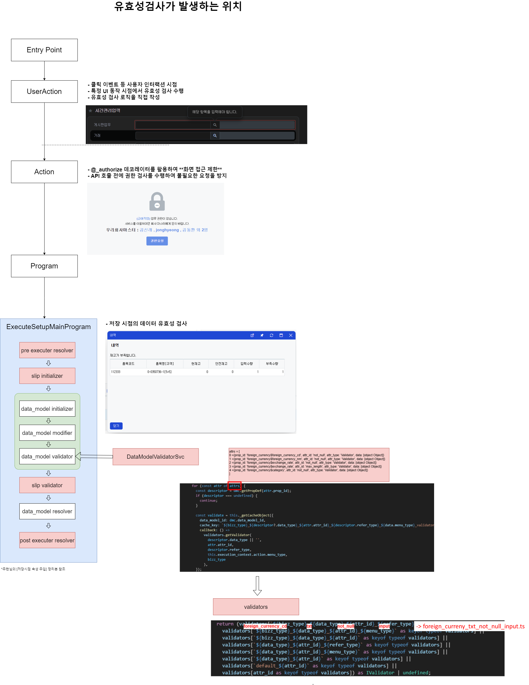

# Daily Retrospective

**작성자**: [허수경]  
**작성일시**: [2025-02-14]

## 1. 오늘 배운 내용 (필수)

- 유효성검사가 발생할 수 있는 위치

### 유효성검사가 발생할 수 있는 위치

- 교육에서 배운 `ExecuteSetupMainProgram` 외에도 다른 위치에서 유효성 검사가 발생할 수 있습니다.
- 아래 그림에서 유효성 검사가 실행될 수 있는 주요 위치를 확인할 수 있습니다.



## 2. 동기에게 도움 받은 내용 (필수)

- 현철님께 시간관리 입력의 게시판 업무, 게시글 번호, 전표 형식(프로젝트, 기획, 개발, 설계) 등에 대해 질문드려 궁금증을 해결할 수 있었습니다.
- 주원님께서 초콜릿과 커피를 사주며 스윗걸이 되고자 하는 목표(?) 를 실천하셨습니다.
- 민준님께 셋업 관련 질문을 퇴근 시간 직전에 드렸음에도 불구하고 친절하게 설명해 주셨습니다.
- 건호님께 Git 관련 질문을 드릴 때마다 마치 만능 사전처럼 척척 답해주십니다.

---

## 3. 개발 기술적으로 성장한 점 (선택)

### 2. 오늘 직면했던 문제 (개발 환경, 구현)와 해결 방법

#### 개발자용 에러 던지기

```
// 어제의 궁금증
거래용 UserAction을 호출할 때 payload에 refer_type 값이 없을 경우, 개발자에게 전달할 에러 메시지를 어떤 방식(팝업, 로그, showError 등등)으로 처리해야 하는지 궁금합니다.
```

- 나의 해결 방법

  - `throw new Error`를 사용하여 명확한 에러 메시지를 던진다.
  - 이렇게 하면, 개발자가 해당 문제를 빠르게 인지하고 수정할 수 있다.

  ```
  if (_.vIsEmpty(conn_refer_type)) {
    throw new Error('Missing required payload: conn_refer_type is empty or undefined.');
  }
  ```

### 3. 위 두 주제 중 미처 해결 못한 과제. 앞으로 공부해볼 내용.

#### Q1. 다른 값을 참고하여 유효성체크를 해야하는 경우, 공통로직에서 어떻게 처리할 수 있을까? 그동안은 개별 로직에서 직접 처리가 가능했지만 공통로직이라면 처리가 불가능 할 것이다.

#### Q2. 입력한 정보는 어떻게 담겨서 확인할 수 있을까?
