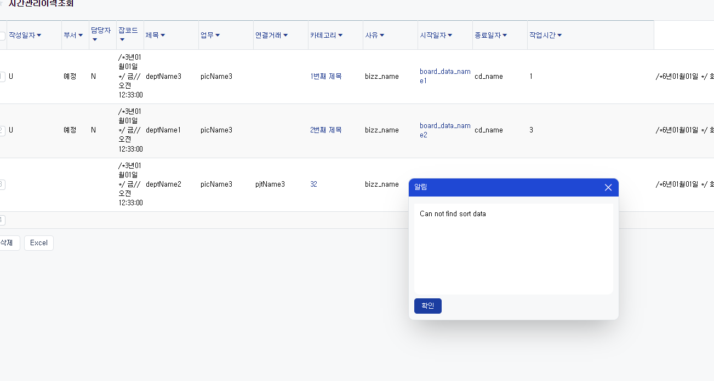

# Daily Retrospective

**작성자**: [나강민]  
**작성일시**: [2025-02-17]

## 1. 오늘 배운 내용 (필수)

## **서치 프로그램(User Action 기반) 구현 및 `search_options` 오류 분석**

### **1. 개요**
이번 분석에서는 **서치 프로그램을 User Action을 통해 구현하는 방법**과 **`search_options` 오류**에 대해 설명합니다. 특히, `ILastSearchOptionRuntime`이 `page_runtime`에 생성되지 않아 `search_options`가 설정되지 않는 문제를 중점적으로 다룹니다.

---

## **2. 서치 프로그램 User Action 구현**
서치 프로그램(Search Program)은 **데이터 조회 및 검색을 일반화하여 처리하는 엔진**입니다. 개발자는 서치 프로그램을 구현할 때, **User Action**을 통해 검색을 실행하고, Feature를 활용하여 다양한 검색 옵션을 적용할 수 있습니다.

### **2.1. User Action 구현 (`SelectBasicListUserAction`)**
```ts
@action_impl(ISelectListUserAction)
export class SelectBasicListUserAction {
	static executeAsync: ISelectListUserAction = async (request) => {
		// 1. 검색 타입 추출
		const search_data_model_type = request.vmc.getPageState<page_state.ISearchPageState>('search')?.search_type;

		// 2. 서치 프로그램 생성 및 Feature 설정
		const search_program = await ProgramBuilder.createAsync<ISearchDataModelGenerateProgramRequest, void>(
			ISearchDataModelGenerateProgram,
			request.execution_context,
			(context) => {
				context.setFeature(
					IBuildProcessFeature,
					new BasicListSearchBuildProcessFeature(request.execution_context, {
						search_type: request.payload.search_type,
						is_summary: search_data_model_type == EN_LIST_SEARCH_TYPE.Summary ? true : false,
					})
				);
			}
		);
	};
}
```

#### **설명**
- `@action_impl(ISelectListUserAction)`: `ISelectListUserAction`을 구현하는 User Action.
- **검색 타입 추출**: `search_data_model_type`을 가져와 **일반 검색인지 집계표 검색인지** 판단.
- **`ProgramBuilder.createAsync` 실행**:
  - 서치 프로그램(`ISearchDataModelGenerateProgram`)을 생성.
  - **Feature 설정**(`BasicListSearchBuildProcessFeature`):
    - 검색 유형(`search_type`)과 **집계 검색 여부(`is_summary`)** 설정.

---

### **2.2. 서치 프로그램 Feature 구현 (`BasicListSearchBuildProcessFeature`)**
```ts
export class BasicListSearchBuildProcessFeature implements IBuildProcessFeature {
	feature_id: string = IBuildProcessFeature.feature_id;
	context: IExecutionContext;
	search_type: ISearchEventType;
	is_summary: boolean;

	constructor(
		execution_context: IExecutionContext,
		search_param: { search_type: ISearchEventType; is_summary: boolean }
	) {
		this.context = execution_context;
		this.search_type = search_param.search_type;
		this.is_summary = search_param.is_summary;
	}

	// 1. 검색 옵션 생성 (SearchOptionProcess)
	buildSearchOptionProcess(): SearchOptionProcess {
		return [
			BasicListGetDefaultSearchOptionResolver,
			getSetupResolver(this.is_summary),
			getDataModelIdResolver(this.is_summary),
			...modifySearchOptionResolver(this.is_summary, this.search_type),
		];
	}

	// 2. 검색 전 데이터 준비 (PrepareProcess)
	buildPrepareProcess(): PrepareProcess {
		return getPrepareProcessResolvers(this.search_type);
	}

	// 3. 데이터 조회 로직 (SearchProcess)
	buildSearchProcess(): SearchProcess {
		return [this.is_summary ? BasicListSummarySearchDataModelResolver : BasicListSearchDataModelResolver];
	}

	// 4. 검색 후 데이터 가공 (PostProcess)
	buildPostProcess(): PostProcess {
		return [
			BasicListProcessBizzAndDataModelResolver,
			BasicListUpdateVMCStateAfterSearchResolver,
			BasicListUpdateDataModelResolver,
			AlertMaxLimitCountResolver,
		];
	}
}
```

#### **설명**
- **검색 옵션(`buildSearchOptionProcess`)**:
  - 기본 검색 옵션 설정(`BasicListGetDefaultSearchOptionResolver`).
  - `getDataModelIdResolver()`, `modifySearchOptionResolver()` 등을 활용하여 검색 데이터 모델 설정.
- **전처리(`buildPrepareProcess`)**:
  - 검색 전 필수 데이터 가공.
- **검색 프로세스(`buildSearchProcess`)**:
  - `is_summary` 값에 따라 일반 검색 또는 집계 검색 실행.
- **후처리(`buildPostProcess`)**:
  - `BasicListUpdateDataModelResolver` 등을 통해 결과 데이터를 업데이트.

---

## **3. `search_options` 오류 분석**

### **3.1. 검색 옵션 처리 로직 (`BasicListGetDefaultSearchOptionResolver`)**
```ts
export class BasicListGetDefaultSearchOptionResolver
	implements SearchOptionResolver<ISearchDataModelGenerateProgramRequest, BasicListSearchOptionProcessResultDto> {
	execution_context: IExecutionContext;
	constructor(execution_context: IExecutionContext) {
		this.execution_context = execution_context;
	}

	async OnExecuteAsync(dto: ISearchDataModelGenerateProgramRequest): Promise<BasicListSearchOptionProcessResultDto> {
		const { vmc, dm_manager } = dto;

		const attribute_feature = this.execution_context.getFeature<attribute.IAttributeFeature>(
			attribute.IAttributeFeature
		);

		const { search_dmc, template_dmc } = getDMC(this.execution_context, vmc, dm_manager);
		const aggregate_type = EN_AGGREGATE_TYPE.Details;

		// 검색 옵션 가져오기
		const search_options = vmc.getPageRuntimeWritable<ILastSearchOptionRuntime>(ILastSearchOptionRuntime);

		return {
			...dto,
			search_options,
			search_dmc,
			template_dmc,
		};
	}
}
```

#### **오류 원인**
- **`search_options`가 `vmc.getPageRuntimeWritable<ILastSearchOptionRuntime>`에서 생성되지 않음.**
- 즉, `ILastSearchOptionRuntime`이 `page_runtime`에서 초기화되지 않은 상태.

---

### **3.2. `ILastSearchOptionRuntime`을 초기화하는 로직 (`page_size_resolver`)**
```ts
export const page_size_resolver: IMenuResolver<menu_attrs.page_size> = async ({
	execution_context,
	page_state,
	page_viewmodel,
	page_runtime,
	setup,
	attribute,
}): Promise<void> => {
	// search_options 초기화 (초기값이 없을 경우 생성)
	if (!page_runtime[ILastSearchOptionRuntime]) {
		page_runtime[ILastSearchOptionRuntime] = {};
	}

	// limit 값 설정
	if (!page_runtime[ILastSearchOptionRuntime].limit) {
		page_runtime[ILastSearchOptionRuntime] = {
			...page_runtime[ILastSearchOptionRuntime],
			limit: attribute.limit_count,
		};
	}

	// page 정보 설정
	if (!page_runtime[ILastSearchOptionRuntime].page) {
		page_runtime[ILastSearchOptionRuntime] = {
			...page_runtime[ILastSearchOptionRuntime],
			page: {
				current_index: 1,
				row_count: 0,
			},
		};
	}

	// 전체 카운트 정보 설정
	if (!page_state?.[PageState.ISearchTotalCount]) {
		page_state[PageState.ISearchTotalCount] = { total_count: 0 };
	}
};
```

#### **오류 해결 방법**
1. **`page_size_resolver`가 실행되는지 확인**.
   - `page_runtime[ILastSearchOptionRuntime]`이 정상적으로 생성되었는지 체크.
2. **`menu_attrs`에서 `ILastSearchOptionRuntime`이 초기화되었는지 확인**.
3. **`ILastSearchOptionRuntime`이 Search Program 실행 전 초기화되도록 보장**.

---

## **4. 결론 및 정리**
### **✅ 서치 프로그램(User Action) 구현 과정**
1. `User Action`(`SelectBasicListUserAction`)에서 검색을 실행.
2. `BasicListSearchBuildProcessFeature`에서 검색 옵션 및 전처리, 후처리 로직 설정.
3. `BasicListGetDefaultSearchOptionResolver`에서 `search_options` 가져옴.

### **❌ `search_options` 오류 원인**
- `ILastSearchOptionRuntime`이 `page_runtime`에 초기화되지 않음.

### **🛠️ 해결 방법**
- `page_size_resolver`가 실행되도록 확인.
- `ILastSearchOptionRuntime`이 `page_runtime`에서 초기화되었는지 확인
- 현재는 setup 코드에 menu attribute의 하드코딩.


## 2. 동기에게 도움 받은 내용 (필수)

건호님 : 오늘 개발외적으로 여러방면에서 케어해주셔서 감사합니다.

주원님 : 맛있는 과자를 기꺼이 주셔서 감사합니다 왕 맛있었어요

수경님 : 데이터의 흐름을 파악하고 있는 도중에 도움을 주셨습니다. 감사합니다!

성재님 : 제가 모르는 서버 로직에 관하여 알려주셨습니다. 감사합니다.

민준님 : 진짜 민준님 아니였으면 저는 오늘 집에 못갔을거에요.. 감사합니다. page_size_resolve가 있다는 사실에 정말 놀랐습니다.

승준님 : 프로젝트 진행사항을 파악하고 알려주셔서 감사했습니다.

주현님 : 항상 챙겨주시고 도와주셔서 감사합니다.

현철님 : 모르는 게 있다면 현철님에게 갑니다. 왜냐면 모든게 해결되기 때문입니다. 정말 감사합니다 오늘도 기능적으로, 개발적으로 모르는게 있다면 다 해결해주셔서 감사합니다.

---

## 3. 개발 기술적으로 성장한 점 (선택)

### 3. 위 두 주제 중 미처 해결 못한 과제. 앞으로 공부해볼 내용.

위 주제는 각각 하나의 선택항목으로 간주합니다.
(위 주제에서 2개 작성하면 2개 선택항목 작성한 셈)


해당 부분에서 sort와 관련된 속성값을 확인하면서 찾아야 할 듯합니다. 
page_size_resolve를 조금 더 알아보면서 sort는 어떻게 처리하는지 알아봐야할 거 같습니다.
---

## 4. 소프트 스킬면에서 성장한 점 (선택)
## **소프트 스킬 성장 정리**  

최근 프로젝트를 진행하면서 **각자의 역할과 전문성이 뚜렷해지면서 동료 간 소통이 더욱 활발해졌다**는 점이 큰 변화였습니다.  
1. **팀 내 지식 공유 활성화**  
   - 특정 부분을 잘 알고 있는 동료를 파악하고, 필요한 정보를 주고받으며 협업이 강화됨.  
   - 서로가 가진 지식을 공유하며 **팀 전체의 역량을 향상**시킴.  

2. **문제 해결 과정의 즐거움 발견**  
   - 각자의 강점을 활용하여 하나씩 문제를 해결해나가는 과정에서 **협업의 재미**를 느낌.  
   - 어려운 문제를 함께 해결하면서 **자연스럽게 더 넓은 시야를 가지게 됨**.  

3. **넓은 시야로 접근하는 문제 해결 능력 향상**  
   - 기술적인 부분뿐만 아니라 **전반적인 프로젝트 흐름을 이해하고 해결책을 고민**하는 습관이 생김.  
   - 단순히 주어진 업무를 수행하는 것이 아니라 **팀과 함께 성장하는 방식**으로 사고가 확장됨.  


---

