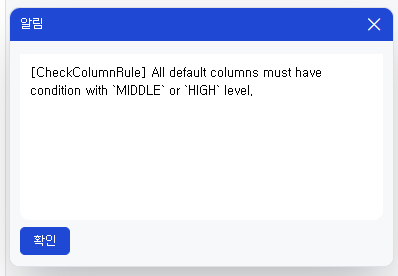

# Daily Retrospective

**작성자**: [황주원]  
**작성일시**: [2025-02-17]

## 1. 오늘 배운 내용 (필수)
### 저장시점 유효성 검사 
동적인 정보는 업무에 따른 거래 조회, 정적인 정보는 프로젝트 | 기획 | 개발 | 설계 부분이 있습니다.

정적인 정보는 bizz_sid로 해당 거래를 찾는 방식이고, 동적인 정보는 refer_type을 통해 변하는 업무의 bizz_id를 찾은 후 거래를 찾는 방식입니다. <br />
아래 코드의 윗 부분은 정적인 prop에 대한 하드코딩 방식이고, 밑 부분은 동적인 prop에 대한 처리 방식입니다.
```ts
{
	prop_id: 'time_manage_s$conn_data_01',
	attr_id: 'bizz_link_info',
	attr_type: EN_ATTR_TYPE.Information,
	data: {
		bizz_sid: 'B_000000E074002', // checkEDT 주원: 프로젝트 bizz_sid 하드코딩
	},
},
{
	prop_id: 'time_manage_s$board_data',
	attr_id: 'bizz_link_info',
	attr_type: EN_ATTR_TYPE.Information,
	data: {
		bizz_refer_type: 'board_bizz', // checkEDT 주원: 거래 > 업무 refer_type 하드코딩
	},
},
```

### 주요 코드
1. Object 에 명세한 dmc를 가져옵니다.
    - attr_id = 'bizz_link_info' 로 되어 있는 항목들의 속성을 가져옵니다.
    ```ts 
    this.master_dmc = dto.dmc.find((x) => _.vIsEquals(x.data_model_id, data_model_id));
    const attr_info = _.vSafe(this.master_dmc?.getAttrsByAttrId('bizz_link_info'));
    ```

2. 속성을 돌면서 해당 거래의 bizz_sid를 가져옵니다.
    - 고정된 업무의 경우에는 해당 속성의 bizz_sid를 찾은 후, 값을 가져옵니다.
    - 동적인 업무의 경우에는 해당 속성의 refer_type으로 bizz_sid를 찾은 후, 값을 가져옵니다.
    - 값이 없는 경우에는 validator를 타지 않도록 처리하였습니다.
    ```ts
    attr_info.forEach((attr) => {
        const bizz_sid = attr.data.bizz_sid
            ? attr.data.bizz_sid
            : this.master_dmc?.getValueByReferType<$$code>(attr.data.bizz_refer_type, 0)?.code;

        const value = this.master_dmc?.getValueByPropId<$$code>(attr.prop_id)?.code ?? '';
        if (_.vIsEmpty(value)) return;

        boardDto.push({
            bizz_sid: bizz_sid,
            data_sid: value,
        });
    });
    ```
3. GetListBoardBizzInfoProgram을 실행시킵니다.
    - 해당 프로그램은 오로지 Dac을 실행시키는 용도입니다.
    ```ts
    const record_dac = DacCommandBuilder.create(
        GetListBoardBizzInfoDac,
        this.execution_context,
        DbConnectionId.PG.CRM
    );
    ```
4. IDataValidationFeature를 실행시켜 삭제된 전표인지 확인합니다.
    ```ts
    const data_feature = this.execution_context.getFeature<IDataValidationFeature>(IDataValidationFeature);
    boardList.forEach((board: any) => {
        data_feature.checkInvalidData({ record: board[0], key_value: board[0]?.data_no });
    });
    ```
### 유효성 프로그램과 Dac 실행 프로그램 차이
🤔 Dac 에서 조회한 후 유효성인지 확인하는 로직은 어디에 들어가야할까?

🅰️ 유효성 프로그램에 들어가야 한다.

처음에는, Dac 에서 조회할 때부터 where 절로 처리해야 한다고 판단했다. <br />
왜냐면 데이터를 가져올 때 더 적은 row가 있으면 서버단의 로직이 좀 더 가벼워지지 않을까? 하는 생각을 했었다.

하지만, 팀장님께서 각각의 역할은 분리되어야 한다고 하셨다. <br />
그 이유로는, 다른 로직에서도 가져다 쓸 수 있어야 하기 때문이다. <br />
유효성 검사 프로그램은 유효성 검사만, Dac 실행 프로그램에서는 Dac만 실행하게 되면 다른 곳에서 쓸 때도 해당 프로그램을 가져다 쓸 수 있다.


### where in 절 
where 과 in은 한 컬럼으로 관리되는 줄 알았는데, 여러 개 컬럼을 넣어도 가능하다.

```ts
SELECT *
FROM bizz03.bd_data_record_board_m
WHERE (bizz_sid, data_sid) IN (
    ('B_000000E072004', '7KWJD6KUNQG52LO'),
    ('B_000000E072008', '794R6L43A8L8JAI'),
    ('B_000000E072008', '794R6L43AEJ8JAJ'),
    ('B_000000E072008', '794R6L43AJJ8JAK'),
    ('B_000000E072008', '7B945TPQQAV8IC6')
);
```

성준 팀장님께서 where in 절을 사용하면 되지 않을까? 라고 했을 때, 두 가지 값으로 조회해야 하는데 어떻게 하지? 라는 의문이 있었습니다.

실제로 구현하기 위해 코드를 짜보니 where in절로 가능했습니다.

### 주인(Owner)
- 모든 속성은 주인(owner)를 가진다.
- 속성은 구체적인 내용을 일반화하고, 추상적인 개념으로 정의한 것을 말하며, 추상적인 개념이 담지 못하는 서로 다른 구체적인 특징들은 속성으로 만들어 관리합니다.
- owner 에는 사용자(`User`), 업무(`Bizz`), 메뉴(`Menu`), 항목(`Prop`), 데이터 모델(`data_model`)이 속합니다.


## 2. 동기에게 도움 받은 내용 (필수)
* 영혼의 5.0 마스터 주현님께서 제가 모르는 부분 (주인, esql 동작 우선순위) 에 대해 알려주셨습니다. 감사합니다 ~ 
* 수경님과 1층에서 9층까지 계단으로 올라오며 체력을 증진할 수 있었습니다. 아주 굿입니다.
* 강민님, 민준님께서 디버깅을 도와주셨습니다. 감사합니다! 
* 현철님께서 5.0 속성에 대해 알려주셨습니다. 감사합니다! 
* 오후에 도형, 건호, 수경, 민준님과 옥상에서 휴식 시간을 가졌는데, 한강도 보이고 너무 좋았습니다.

---

## 3. 개발 기술적으로 성장한 점 (선택)

### 1. 교육 과정 상 배운 내용이 아닌 개인적 호기심을 해결하기 위해 추가 공부한 내용

#### insertBulk
where 절을 짜기 위해 참조할 코드를 찾던 중, insertBulk 문법을 봤습니다.

해당 문법은 DML 구조로 여러 데이터를 삽입 가능한 구조였습니다. <br />
where 절도 이렇게 객체 배열로 삽입 가능하면 좋겠다는 생각을 가졌습니다.

```ts
function insertBulk<T extends $TableESqlExpression>(tableID: $TableIdentifier | $TempTableIdentifier, valueSets: {}[], optionHandler?: Action1<$InsertOptionHandler<T>>): $InsertBulkStatement<T>;
```

### 2. 오늘 직면했던 문제 (개발 환경, 구현)와 해결 방법
#### sql 문법 에러

tenant_sid 는 필수로 확인해야 한다. 라는 의미일 것 같은 에러가 발생했습니다.

아래의 문법을 추가하니 에러는 해결되었고, 회사 고유 정보는 민감한 부분이기 때문에 해당 조건을 넣지 않았을까 는 생각이 들었습니다.

```ts
.from<pg.bd_data_record_board_m>(pg.bd_data_record_board_m, (opt) => {
    opt.alterCheckColumnRule(ENUM_CONDITION_LEVEL.HIGH, (t) => [t.tenant_sid]);
})
```
---

## 4. 소프트 스킬면에서 성장한 점 (선택)
* 주말동안 생각해온 답을 직접 디버깅해보면서 파악해 보니 더 잘 이해가 되었습니다. 아직은 많이 부족하지만 과제를 하나씩 수행해보면서 질문에 조금 더 적합한 답을 찾아가고 있습니다. 