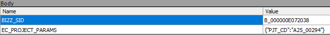

# Daily Retrospective

**작성자**: 고건호
**작성일시**: 2025-02-18

## 1. 오늘 업무 내용

오늘 작업은

```plain
시간관리 조회 화면에서 특정 row의 `보기`를 클릭하면 `dev._progress` 게시판에서 해당 잡 코드를 지닌 게시물들을 리스트 형태로 조회할 수 있습니다.
```

기능을 위한 `UserAction`을 개발하는 것이었습니다.

현재 센터에서 제공되는 일정관리에서 잡 코드를 누르면 아래의 사진과 같은 패킷이 전송되는 것을 볼 수 있습니다.



### `GetConnPjtSearchUserAction`

기존의 `GetConnDataSearchUserAction` 같은 경우는 특정 row에서 데이터(잡 코드)를 추출하는 로직이 없었기에 `GetConnPjtSearchUserAction`을 생성했습니다.

```typescript
import { EN_MENU_TYPE } from "ecount.fundamental.define/enum";
import { action_impl } from "ecount.infra.common/decorator";
import { PageIdentifier, cmcd } from "ecount.infra.base/abstraction";
import { IBaseUserActionRequest, IOwnerInfo } from "ecount.infra.bridge/user_action";
import { ProgramBuilder } from "ecount.infra.common/program";
import { IGetConnDataSearchUserAction, util } from "ecount.usecase.common/@abstraction";
import { FromBizzInfoDto, IGetFromBizzInfoProgram } from "ecount.usecase.basiccode/@abstraction";
import {
  IGetPjtUserAction,
  IGetPjtUserActionPayload,
  IGetPjtUserActionResult,
} from "ecount.usecase.timemanage/@abstraction";

@action_impl(IGetConnDataSearchUserAction)
export class GetConnPjtSearchUserAction {
  static executeAsync: IGetConnDataSearchUserAction = async (request): Promise<any> => {
    const { userActionExecutor, payload, owner, dm_manager } = request;

    const data_type = "$$multi_code";

    /**
     * dev._progress 게시판의 bizz_sid
     */
    const target_bizz_sid = payload.options?.conn_data_sid;
    if (!target_bizz_sid) {
      request.vmc.alert($Resx.rex05966);
      return;
    }

    /**
     * `보기`를 클릭한 prop의 time_manage$pjt 값 추출
     * 추후 메서드로 분리하는 방식으로 리팩토링
     */
    const data_model_index = owner.data_model_index;
    const target_pjt = dm_manager.getDataModelContainer("time_manageXlist").getDataModel()[
      data_model_index as number
    ].time_manage_s$pjt;

    const linked_slip_bizz_info = _.find(cmcd.v5_bizz_info, (a) => _.vIsEquals(a.bizz_sid, target_bizz_sid));
    const target_page_identifier = new PageIdentifier(linked_slip_bizz_info?.page_identifier ?? "IBoardPopupPage");

    const target_menu_sid =
      linked_slip_bizz_info?.list_menu_sid ?? util.MenuTypeSidByMenuSidMap[target_bizz_sid]["IBoardListPage"];

    const from_bizz_info = await (
      await ProgramBuilder.createAsync<IBaseUserActionRequest<IGetPjtUserActionPayload>, FromBizzInfoDto>(
        IGetFromBizzInfoProgram,
        request.execution_context
      )
    ).executeAsync(request as unknown as IBaseUserActionRequest<IGetPjtUserActionPayload>);

    const page_route_options = {
      identifier: target_page_identifier,
      bizz_sid: target_bizz_sid,
      menu_type: EN_MENU_TYPE.PopupSearch,
      menu_sid: target_menu_sid,
      param: {
        menu_sid: target_menu_sid,
        use_checkbox: util.code.isMultiCodeType(data_type),
        from_bizz_info: from_bizz_info,
      },
    };

    const { code_data } = await userActionExecutor.onDispatchActionAsync<
      IGetPjtUserActionPayload,
      IGetPjtUserActionResult
    >(IGetPjtUserAction, {
      page_route_options,
      bizz_sid: target_bizz_sid,
      action_target: payload.action_target,
      code_data: request.payload.code_data,
      ec_project_params: {
        pjt_cd: target_pjt,
      },
    });

    return code_data;
  };
}
```

### `GetPjtUserAction`

`payload`에 `bizz_sid`와 `ec_project_params`를 담아 팝업으로 넘겨줘야 하는데, 기존의 `GetCodeUserAction`에서 사용하는 `IGetCodeUserActionPayload`에는 `ec_project_params` 프로퍼티가 따로 선언되어 있지 않았기 때문에, 해당 부분 또한 생성해줬습니다.

```typescript
import { ui_handler } from "ecount.infra.bridge/feature";
import { action_impl } from "ecount.infra.common/decorator";
import { $$code, $$multi_code } from "ecount.fundamental.define/type";
import { IBaseUserActionRequest } from "ecount.infra.bridge/user_action";
import { system } from "ecount.infra.bridge/feature";
import {
  IGetPjtUserAction,
  IGetPjtUserActionPayload,
  IGetPjtUserActionResult,
} from "ecount.usecase.timemanage/@abstraction";
import { GetCodePageMessageDto } from "@shared_usecase_common/@abstraction";
import { EN_BIZZ_TYPE, EN_FOCUS_MODE, EN_MENU_TYPE } from "ecount.fundamental.define/enum";

@action_impl(IGetPjtUserAction)
export class GetPjtUserAction {
  static executeAsync: IGetPjtUserAction = async (request) => {
    const is_multi_code = !!request.payload.code_data;
    const { action_target, is_added } = request.payload;

    if (is_multi_code) {
      if (action_target === "CHANGE") {
        const { open_popup, code_data } = await searchMultiCode(request);
        if (!open_popup) return { code_data };
      }

      return (await openMultiCodePopupAsync(request)) as any;
    }
  };
}

async function openMultiCodePopupAsync(request: IBaseUserActionRequest<IGetPjtUserActionPayload>) {
  const { execution_context, payload } = request;
  const { page_route_options, page_load_options, is_v5_flag, is_added } = payload;
  const v5_flag: boolean = is_v5_flag ?? false;

  let code_data: $$multi_code | undefined;
  const feature = execution_context.getFeature<ui_handler.IHandleRouteFeature>(ui_handler.IHandleRouteFeature);

  return new Promise((resolve) => {
    feature
      .openPopupAsync<any, GetCodePageMessageDto>(page_route_options, page_load_options, async (result) => {
        //@TODO 다음 로직을 microtask 에 넣어 실행하기 위함
        await Promise.resolve();
        await Promise.resolve();

        if (result?.message) {
          const v5_data: any = result?.message;
          //  V5 에서는 내려오는 형태가 다를 수 있음 3.0, 5.0 에서 공존해서 받도록 하려면 data:[{}] 와 같은 형태로 내려와야함 TP.135534
          if (v5_flag) {
            const current_v5_data = v5_data.data as $$multi_code | $$code;
            if (_.vIsEmpty(current_v5_data)) {
              return;
            }
            result.message = _.isArray(current_v5_data) ? current_v5_data : [current_v5_data];
          }

          // @TODO hyunoh (tp.146612) 코드검색 팝업에서 닫기 버튼을 누를 시, additional_info 값이 반환되어, undefined가 추가됨
          // ICloseBasicCodeUserAction 수정 후, 삭제되어야 하는 코드
          if (_.isEqual(result.message[0]?.additional_info?.focus_mode, EN_FOCUS_MODE.CLOSE)) {
            _.pullAt(result.message, 0);
          }

          const merge_data =
            is_added !== false
              ? mergeData(request.payload.code_data, result.message as $$multi_code)
              : (result.message as $$multi_code);

          if ((await checkMaxCount(request, merge_data)) === false) {
            return;
          }

          code_data = merge_data;
        }

        resolve({ code_data });
      })
      .then((result) => {
        if (result.closed) {
          resolve({ code_data: undefined });
        }
      });
  });
}

async function searchMultiCode(request: IBaseUserActionRequest<IGetPjtUserActionPayload>) {
  const { execution_context, payload } = request;

  if (_.isEmpty(payload.http_identifier)) {
    return { open_popup: true };
  }

  const { http_payload, page_size } = getHttpPayloadForAsterisk(request);
  const http_client = execution_context.getFeature<system.IHttpRequestFeature>(system.IHttpRequestFeature);
  let { result } = await http_client.sendAsync<any, any>(payload.http_identifier as any, {
    ...http_payload,
    autoPageProgress: false,
  });
  if (payload.is_v5_flag && result) {
    const target_data = result.data_list ?? result.data ?? [];
    const tempList: $$multi_code = [];
    _.forEach(target_data, (item) =>
      tempList.push({
        code: item.add_code$add_cd,
        sid: item.add_code$add_cd,
        name: item.add_code$add_cd_nm,
      })
    );
    result = tempList;
  }

  const merge_data = mergeData(request.payload.code_data, result);

  if (result?.length > 0 && result?.length <= page_size) {
    if (result === undefined || (await checkMaxCount(request, merge_data)) === false) {
      return { open_popup: false };
    }
    return { open_popup: false, code_data: merge_data };
  }

  return { open_popup: true };
}

function mergeData(code_data: $$code | $$multi_code, search_data: $$multi_code) {
  const current_data = _.isArray(code_data) ? code_data : [code_data];
  if (!search_data) return current_data;

  return _.uniqBy([...current_data, ...search_data], "sid");
}

async function checkMaxCount(request: IBaseUserActionRequest<IGetPjtUserActionPayload>, data: $$multi_code) {
  const { vmc, payload } = request;
  const max_count_default = payload.page_route_options.param?.max_count || 200;

  if (data.length > max_count_default) {
    // 5.0팝업 close 등 처리 이후 alert 렌더링 타이밍 주기
    await new Promise((resolve) => setTimeout(resolve, 0));

    //z-index문제 발생하는 포인트
    vmc.alert(_.vFormat($Resx.rex00329, max_count_default));
    return false;
  }
  return true;
}

function getHttpPayloadForAsterisk(request: IBaseUserActionRequest<IGetPjtUserActionPayload>) {
  const { http_payload, page_route_options } = request.payload;
  const max_count_default = page_route_options.param?.max_count || 200;

  // api에서 검색되는 최대 개수 설정
  let page_size = 1;
  const param = http_payload.data.keyword;
  let del_flag;
  const asterisk_quick_search: boolean = http_payload.data?.asterisk_quick_search ?? false;
  // 맨뒤에 *로 검색 했을시, 퀵서치에 필요한 조건 넣기
  if (
    http_payload.data?.asterisk_quick_search == true &&
    http_payload.data.keyword.length > 1 &&
    http_payload.data.keyword.endsWith("*")
  ) {
    page_size = max_count_default;
    page_route_options.param.quick_search = true; // 팝업에서 사용중단 포함여부
    page_route_options.param.keyword = param.slice(0, -1);
    http_payload.data.keyword = http_payload.data.keyword.slice(0, -1);
    del_flag = "";
  }

  const http_payload_data = {
    data: {
      asterisk_quick_search: asterisk_quick_search,
      option: { page_size: page_size + 1, is_asterisk_quick: asterisk_quick_search, delete_flag: del_flag },
      ...http_payload.data,
    },
  };

  return { http_payload: http_payload_data, page_size };
}
```

`GetCodeUserAction`을 참고하여 작성하였고, 현재 저희 프로젝트에서 불필요한 부분은 제거했습니다.

### `IGetPjtUserAction`

```typescript
import { ActionIdentifier, UserActionIdentifier, V3ActionIdentifier } from "ecount.infra.base/abstraction";
import { IUserActionExecutor } from "ecount.infra.bridge/user_action";
import { ICodeSearchBasePayload } from "@shared_usecase_common/@abstraction";
import { IPageLoadOptions, IPageRouteOptions } from "ecount.infra.bridge/dto";
import { $$code, $$multi_code } from "ecount.fundamental.define/type";
import { EN_BIZZ_TYPE, EN_MENU_TYPE } from "ecount.fundamental.define/enum";

export interface IGetPjtUserActionPayload<T = any>
  extends Pick<ICodeSearchBasePayload<any>, "action_target" | "code_data" | "is_added"> {
  page_route_options: IPageRouteOptions<T>;
  page_load_options?: IPageLoadOptions;
  http_identifier?: ActionIdentifier | V3ActionIdentifier;
  http_payload?: any;
  is_v5_flag?: boolean;
  options?: any;
  from_bizz_type?: EN_BIZZ_TYPE;
  from_menu_type?: EN_MENU_TYPE;
  bizz_sid?: string;
  menu_sid?: string;
  is_from_bottom?: boolean;
  ec_project_params?: any;
}

export interface IGetPjtUserActionResult {
  code_data: $$multi_code | $$code;
}

export const IGetPjtUserAction = new UserActionIdentifier("IGetPjtUserAction");
export type IGetPjtUserAction = IUserActionExecutor<IGetPjtUserActionPayload, IGetPjtUserActionResult>;
```

## 2. 동기에게 도움 받은 내용

민준 님에게 평소에 궁금했던 자바스크립트 내용을 질문했고, 세세하게 답변을 해주셔서 정말 좋았습니다.
