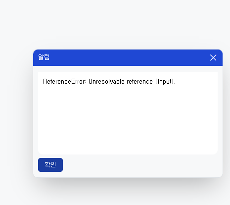
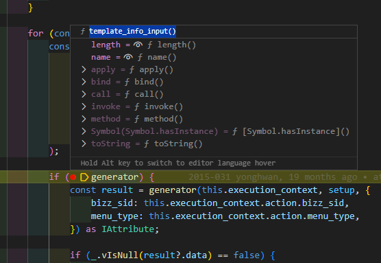
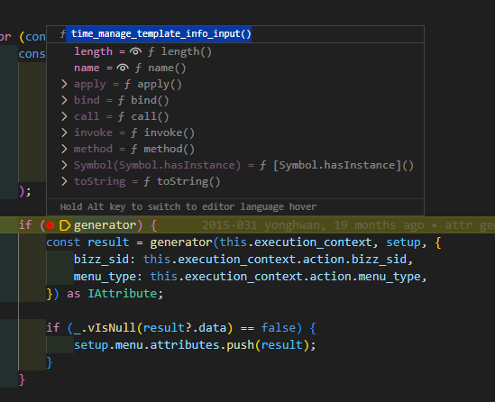

# Daily Retrospective

**작성자**: [김승준]  
**작성일시**: [2025-02-18]

## 1. 오늘 배운 내용 (필수)

-   시간관리이력입력의 양식설정 오류 수정에 맞춰 속성들을 generator로 제대로 가져오도록 수정하였습니다.

-   시간관리조회의 속성들을 generator로 가져오는 잡을 맡아 inventory와 board를 디버깅하며 학습하였습니다.

## 2. 동기에게 도움 받은 내용 (필수)

-   **주현님**이 SSDB 캐싱을 사용하지 않도록 하는 방법을 알려주셨습니다.
-   **민준님**이 list의 속성을 generator로 변환하는 잡을 맡게되어 함께 디버그하며 학습하였습니다.

---

## 3. 개발 기술적으로 성장한 점 (선택)

아래의 3가지 주제 중 하나를 선택하여 작성합니다.

### 1. 교육 과정 상 배운 내용이 아닌 개인적 호기심을 해결하기 위해 추가 공부한 내용

### 2. 오늘 직면했던 문제 (개발 환경, 구현)와 해결 방법

-   시간관리입력 창이 제대로 나타나지 않는 문제가 있었습니다.

### 시간관리입력





### 시간관리이력입력



`Enums.ts`의 `bizz_type` 오타로 인해 `generator_selector`에서 `time_manage_template_info_input`이 아닌 `template_info_input`이 불러오고 있었습니다.

```ts
const v3_menu_info = setup.menu.attributes.find((x) => _.vIsEquals(x.attr_id, "v3_menu_info"))?.data;
const form_type = v3_menu_info.input.form_type;
```

`template_info_input`에서는 v3양식을 불러오는 부분이 있는데 `time_manage`에는 양식 또한 5.0으로 되어있기 때문에 undefined.data 에 접근할 수 없기 때문에 오류가 나타납니다.

### 3. 위 두 주제 중 미처 해결 못한 과제. 앞으로 공부해볼 내용.

-   refer_type이 title 일때 user_action trigger가 생성되고 있습니다.<br>
    menu_type이 list일때만 들어가야 합니다.<br>
    그러나 현재 list_search도 menu_type이 list로 들어오는 상황이라 속성이 생성되고 있습니다.

`AttrList.ts`

```ts
title: {
		[EN_MENU_TYPE.ListSearch]: [renderer_attrs.hide_fn, validator_attrs.special_regex],
		[EN_MENU_TYPE.PopupSearch]: [renderer_attrs.hide_fn, validator_attrs.special_regex],
		[EN_MENU_TYPE.List]: [renderer_attrs.view_type, trigger_attrs.user_action],
		[EN_MENU_TYPE.Input]: [renderer_attrs.combine_props, renderer_attrs.flex_item, validator_attrs.special_regex],
		[EN_MENU_TYPE.HistorySearch]: [renderer_attrs.hide_fn, validator_attrs.special_regex],
		[EN_MENU_TYPE.History]: [renderer_attrs.view_type, trigger_attrs.user_action],
		[EN_MENU_TYPE.Popup]: [renderer_attrs.view_type, trigger_attrs.user_action],
	},
```

`title_user_action.ts`

```ts
export const time_manage_title_user_action_list: IReferTypeAttrGenerator<any> = (execution_context, setup, target) => {
    return {
        prop_id: target.prop.prop_id,
        attr_id: trigger_attrs.multi_user_action,
        attr_type: EN_ATTR_TYPE.Trigger,
        data: {
            sort: { identifier: "ISelectListUserAction" },
            link: {
                identifier: "IOpenModifyBasicUserAction",
                payload: { action_mode: EN_ACTION_MODE.GetModify, identifier: "ITimeManageInputPage" },
            },
        },
    };
};
```

---

# 학습내용

## time_manage_list

data_model_definition의 refer_type과 특이사항, 생성되는 속성등을 간단하게 정리하였습니다.

전환 : 추후진행

-   btn형식으로 view_type

부서 : dept_nm

-   (rex00000) 로 표시

담당자 : user_nm

-   list.ts pic.nm ->user.nm(rex00000) 변경

작업시간 : 추후진행

-   계산해서 넣어야함

업무 : board_bizz 추가

카테고리 : cd_001 추가

진행상태 : work || progress_status :
-(progress_status) renderer_attrs.view_type, renderer_attrs.progress_status, trigger_attrs.multi_user_action,

잡코드 : pjt_nm

-   (rex00000)로 표시됨

제목 : title

-   (renderer_attrs.view_type, trigger_attrs.user_action)

게시글번호 : num_004

작업 : ?? slip_link_list?? // 추후진행

테스트요청: //추후 진행(다른거 먼저)

Dev// 추후 진행(다른거 먼저)

연결거래// 추후 진행(다른거 먼저)

이력// 추후 진행(다른거 먼저)

작성일자 write_dtm

-   (renderer_attrs.value_format, validator_attrs.limit_year)

시작일자 start_dtm

-   (renderer_attrs.value_format, validator_attrs.limit_year)

종료예정일자 :end_exprt_dtm

-   (renderer_attrs.value_format, validator_attrs.limit_year)

종료일자 end_dtm

-   (renderer_attrs.value_format, validator_attrs.limit_year)

비율 // 추후진행 (다른거 먼저)

배포일자 dtm_001

-   list.ts에서 dt_001이 두개 존재, 하나 오타인듯 => 수정

우선순위 num_001

-   (renderer_attrs.value_format)

작업일수 num_002

추가작업일수 num_003

qc요청일 dt_001

num_002

-   기능명세에서 이상한 컬럼 값 존재, 작업일수인지 뭔지 모르겟음.

메모 :txt_002

-   (renderer_attrs.value_forma)

기타 : txt_001

-   (renderer_attrs.value_forma)

변경사항 : txt_003

-   (renderer_attrs.value_forma)

how to dev: txt_004

-   (renderer_attrs.value_forma)

data_dt // 거래일자?

-   display : false
-   (renderer_attrs.view_type, trigger_attrs.user_action)
