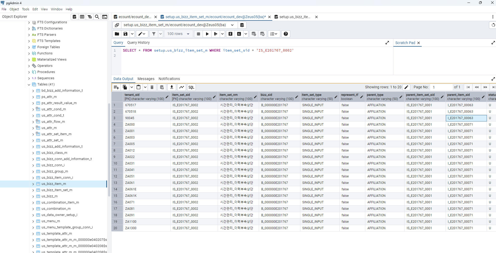

# Daily Retrospective

**작성자**: [박성재]  
**작성일시**: [2025-02-18]

## 1. 오늘 배운 내용 (필수)

- 그룹형 Setup 정보를 구성해서 내보내주기
- 파생 DB가 제대로 마이그레이션 되지않았을 때 벌어지는 일

<br/>

### 그룹형 Setup 정보를 구성해서 내보내주기

```typescript
// ToDo: 공통화 고려 필요
	private _addGroupData(dataModels: IArrayDataModelMapper | IDataModelMapper, dto: GetBasicSetupRequestDto): void {
		const bizz_definition = this.execution_context.bizz_mgr.getBizzDefinition(this.execution_context, dto.bizz_sid);
		// const bizz_id = bizz_definition?.bizz_id;
		const prefix = 'time_manage_s';
		const keys = prefix ? this._getGroupKeys(prefix) : [];

		Object.entries(dataModels)?.forEach(([data_model_id, data_model]) => {
			// data_model_id에 대한 모든 인덱스를 순회
			if (_.vIsEmpty(data_model)) return;

			data_model?.forEach((entry: IDataModelProp, index: number) => {
				if(_.vIsEmpty(entry))
					return;

				keys.forEach((key) => {
					if(key === 'cd_001') {
						data_model[index][`${prefix}$${key}`] = {
							code: entry[`${prefix}$cd_sid_001`],
							sid: entry[`${prefix}$cd_sid_001`],
							name: entry[`${prefix}$cd_nm_001`],
						};
					}
					else {
						const keyPrefix = `${prefix}$${key}`;
						data_model[index][`${prefix}$${key}`] = {
						code: entry[`${keyPrefix}_sid`],
						sid: entry[`${keyPrefix}_sid`],
						name: entry[`${keyPrefix}_nm`],
					};
					}
				});
			});
		});
	}

	private _getGroupKeys(bizz_id: string): string[] {
		let keys: string[] = [];

		switch (bizz_id) {
			case 'time_manage_history':
				{
					keys = ['pjt', 'user', 'dept'];
				}
				break;
			case 'time_manage_s':
				{
					keys = [
						'board_bizz',
						'board_data',
						'conn_data_01',
						'conn_data_02',
						'conn_data_03',
						'conn_data_05',
						'pjt',
						'dept',
						'user',
						'cd_001',
						'progress_status',
						'updater',
					];
				}
				break;
		}
		return keys;
	}
```
입력이나 조회화면 중, 프로젝트나 잡코드와 같은 `$$code`의 데이터 타입을 가진 항목들이 존재했습니다. 해당 항목들은 서버에서 데이터모델을 내려줄 때, DB에 존재하는 정보를 활용해 객체 형태로 만들어 데이터모델에 넣어주어야 했습니다.

관련 로직을 위처럼 1차적으로 하드코딩했습니다. 이제 `data_model_id`를 활용해서 해당 업무에 종속된 로직으로 프로그램이나 SVC를 이용해 리펙토링이 필요합니다.

<br/>

### 파생 DB가 제대로 마이그레이션 되지않았을 때 벌어지는 일



오늘 원래 조회화면이 잘 보이던게 갑자기 제대로 보여지지 않는 문제가 있었습니다. 아무리 문제를 찾아봐도 문제가 없었던 것으로 파악되었습니다.

추후 알고보니 파생 관련 마이그레이션 시, 파생 속성이 명세된 DB 데이터가 있는데 제대로 반영이 되지 않아서 화면을 조회할 때 기본값을 채워주는 `SlipDefaultValueAttrProgram`에서 파생 정보를 채워줄 때, `prop_id`값이 이상하게 불러와지는 이슈였습니다.

해당 문제 경험을 통해 되던게 안되거나 하는 문제가 있을 때면, DB문제 혹은 파생 쪽 문제가 아닌지 의심해볼 필요가 있다는 사실을 깨달았습니다.

<br/>

## 2. 동기에게 도움 받은 내용 (필수)

#### 김승준 선임
야근을 같이하며 즐거운 시간을 보냈습니다.

#### 최현철 선임
파생 관련 에러가 생겼었는데 DB도 함께 보며 문제를 해결하였습니다.