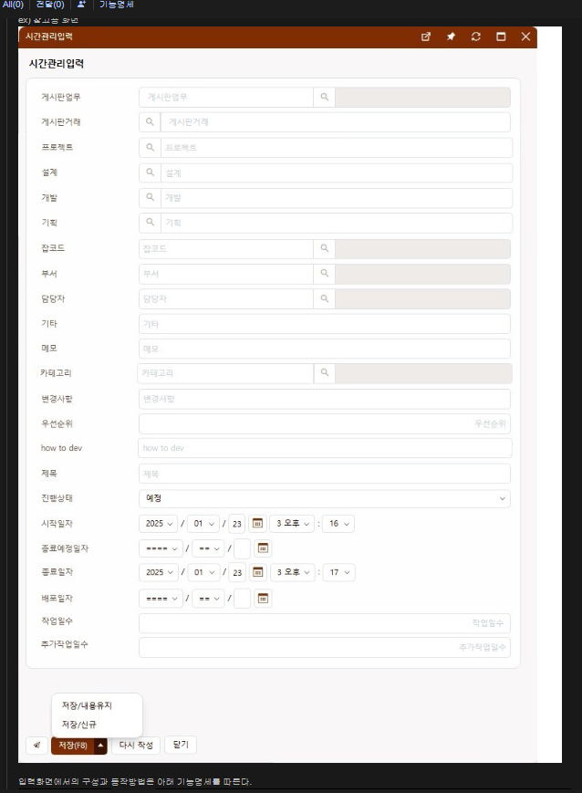
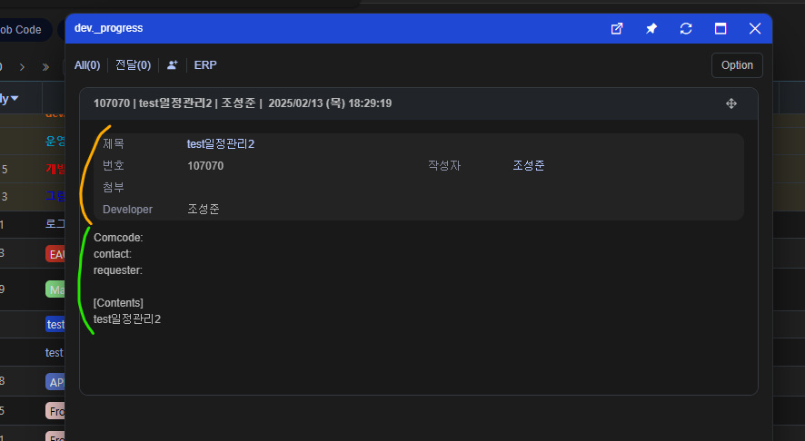

# Daily Retrospective

**작성자**: [박주현]  
**작성일시**: [2025-02-18]

---

# 1. 오늘 배운 내용

## 연결데이터에는 왜 record_sid가 아닌 data_sid 를 활용할까?

DB 와 데이터를 연동하기 시작하면서 하나 궁금증이 생겼습니다. 저희는 시간관리업무와 시간관리이력 업무를 작업하고 있습니다. 그리고 두 업무 모두 다 상단만 존재하죠.

DB 조회 관점에서 생각해보겠습니다. DB 는 인덱스를 설정하지 않아도, PK 와 FK 를 설정하면 자동적으로 클러스터링 인덱스를 생성해줍니다.
인덱스(Index)는 검색 성능을 향상시키기 위한 데이터 구조입니다.
테이블의 특정 열(column)에 대한 **색인(목차)** 을 생성하여, 데이터 조회 속도를 빠르게 합니다.

 

우리 이카운트 테이블을 보면 `tenant_sid` 와 `record_sid` 를 PK 로 갖고 있습니다. 즉, `tenant_sid` 와 `record_sid` 기준으로 빠르게 조회가 가능하다는 말입니다.

우리의 `시간관리업무`를 살펴보면 연결된 `게시판 거래_sid` 를 담는 컬럼이 있습니다. 지금 현재 `board_data_sid`로 명명되어 있죠.

이곳에 board의 record_sid 를 넣으면 나중에 dev 또는 연결 거래 의 `[보기]` 를 클릭할시 PK 가 제공해주는 인덱스를 통해 빠르게 조회할 수 있다고 생각했습니다.

하지만 현재 저희는 `board_data_sid`에 거래의 `data_sid` 값을 넣어주고 있습니다. `record_sid` 아니고 말이죠. 그 이유에 대해 학습해 보았습니다.

### 1️⃣ data_sid?

먼저 `data_sid` 에 대해 알아보고 가겠습니다. 여러분도 모두 아실테지만 한 번 더 리마인드 해보겠습니다. `data_sid` 는 상하단으로 나뉘 데이터를 묶기 위해 사용합니다. 하나의 전표를 구분지을 수 있는 값이기도 하죠.

 

 
위 견적서 수정을 보겠습니다. 노랑 박스는 상단이고, 빨간 박스는 하단인 걸 모두 아실겁니다. 견적서를 수정하게 되면 상단만 수정하게될까요? 아니면 하단만 수정하게될까요? 견적서 수정은 둘 모두를 데이터로 가져가게 됩니다. 즉, 하나의 전표 단위로 수정하게 됩니다. slip 안에서 각각의 dmc(quotation_s, quotation_multi) 로 구분지어질 수 있지만 중요한건 하나의 전표 셋트로 돌아다닌 다는 것입니다.

상단과 하단의 각각의 record_sid를 갖게됩니다. record_sid는 DB 테이블에서 한 행, 한 행을 구분지을 수 있는 컬럼입니다. 즉 중복될 수가 없죠.

data_sid 는 전표 단위의 값이라고 했습니다. 한 테이블에서 중복될 일은 없지만, 두 테이블(e.g. `bd_inv_single`, `bd_inv_multi`) 을 기준으로 한다면 중복되는 값을 가질 수 있죠. 왜냐하면 상단이 data_sid 를 갖고 하단 또한 상단이 가진 data_sid을 똑같이 갖기 때문입니다.

이렇게 data_sid 가 있으므로 우리는 연결된 전표를 불러올때 `data_sid` 를 통해 상하단 내용을 한번에 가져올 수 있을 겁니다.

### 2️⃣ 그럼 우린 왜 data_sid를 쓰나?

`data_sid`의 사용이유는 이제 모두 아셨을 겁니다. 상단, 하단을 하나의 전표로서 셋트로 다루고 싶기 때문입니다.

 

위는 저희의 시간관리 업무 입력창입니다. 시간관리는 많은 항목을 갖지만 결국 상단으로만 처리하기로 했습니다. 즉 하단이 없다는 것이죠.

 

기존 일정관리를 보면 이렇게 본문 내용을 적는 항목이 있었습니다.

 
본문 내용을 적으면 게시판 거래에 본문에 내용이 그대로 나타나게 됩니다.

work.275284 3번답글을 보면 저희는 본문/댓글을 생략하기로 하였습니다. 이렇게 되면 게시판에 대해 하단(본문)이 없게되고, 상단 데이터만 저장하게 됩니다.

전 궁금증이 들었습니다. 하단이 없으면, `board_data_sid`에 거래의 `data_sid` 가 아닌, `record_sid`를 넣어 조회 성능 향상을 도모해볼 수 있지 않나?
그렇게 되면 연결 전표(`[보기]`링크)를 누를때 `tenant_sid` 와 `record_sid` 로 관련 게시판 거래를 빠르게 찾을 수 있을텐데...

record_sid를 사용하지 않은 이유는 다음과 같습니다.

**첫번째로 일반화 입니다.**

모든 데이터 대해서 연결된 데이터 즉 전표 데이터들은 `data_sid` 저장하고 있습니다. 이에 대한 규칙을 준수해야지 공통된 로직을 짜기에도 애로사항이 발생하지 않을 겁니다.

만약 시간관리 업무만 연결데이터에 `record_sid` 를 사용한다면 시간관리 업무만 특화된 로직과 프로그램을 만들어야할 것입니다. 이는 저희 방향성에 맞지 않습니다.

**두번째로는 확장성 고려입니다.**

지금은 본문/댓글에 대한 내용이 없지만, 추후에 기획을 통해 새롭게 추가될 수 있습니다. 이때 그 전까지는 record_sid로 저장했다가 기능이 바뀐 후엔 data_sid로 저장하게된다면, 불필요한 로직이 추가가 되겠죠? 예를 들어 `board_data_sid` 이 `data_sid`, `record_sid`이 모르니 일단 data_sid로 가정하고 본문 테이블에서 data_sid 조회시 아무 값이 안나오면 빈 내용을 나오게 하는 로직이 추가가 되겠죠.
아니라면 `record_sid`로 저장한 값들을 모두 `data_sid`로 마이그레이션을 해줘야하는 불상사가 발생할 것입니다.

이런 복합적인 이유는 현재 이카운트에선 연결데이터 값에 그 거래에 대한 `data_sid` 를 넣어주게 됩니다.

---

# 2. 동기에게 도움 받은 내용

현철님께서 부속과 파생에 관련된 내용을 친절하게 설명해주셨습니다. 또한 DB 에서 양식 정보 보는 과정들을 어깨너머로 가르쳐주셨습니다.

주원님이 pre execute program 을 수정하면서 제 부분에서 수정할 것을 알려주셨습니다. 그리고 커피도 사주셨습니다.

승준님이 오늘 제일 큰 이슈 사항을 해결해주시고, 자잘자잘한 질문에 대해서 대답을 해주셨습니다.

---
