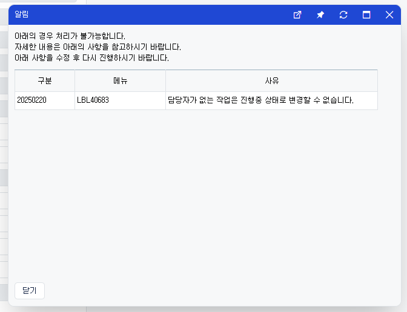
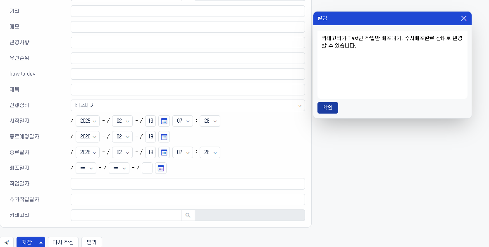
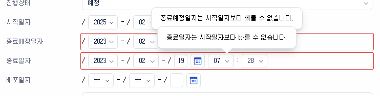

# Daily Retrospective

**작성자**: [허수경]  
**작성일시**: [2025-02-18]

## 1. 오늘 업무 내용

- 진행상태(진행중)이면 담당자 필수 체크
- 진행상태 - 카테고리 유효성체크
- 일자무결성체크

### 진행상태(진행중)이면 담당자 필수 체크

#### 1) 기능명세

- 담당자 값이 없는 경우, 진행상태 진행중으로 변경하여 저장 시 저장안되고 체크한다.
  - "담당자가 없는 작업은 진행중 상태로 변경할 수 없습니다."

#### 2) 구현 및 구현화면

- CheckProgressStatusByUserProgram.ts

```ts
// 담당자
const user_dto: string =
  this.master_dmc?.getValueByReferType<$$code>("user")?.code ?? "";

// 진행상태
const progress_status: string =
  this.master_dmc?.getValueByReferType("progress_status_cd") ?? "";

// 하드코딩된 부분
if (!_.vIsEquals(progress_status, "진행중")) {
  return result;
}

if (!_.vIsEmpty(user_dto)) {
  return result;
}

result.status = false;
result.exception = ExceptionBuilder.create<ISlipValidatorException>(
  ISlipValidatorException,
  {
    key: error_info_feature.getValueByKey(
      _.vSafe(this.master_dmc),
      this.execution_context.action.bizz_sid
    ),
    bizz_name: error_info_feature.getBizzName(),
    message: "담당자가 없는 작업은 진행중 상태로 변경할 수 없습니다.",
    display_type: EN_ERROR_DISPLAY_TYPE.Popup,
  }
);
result.continuous = true;
return result;
```



#### 3) 고민한 부분

1. 진행상태 값 비교: \_nm vs \_cd

- 현재 진행상태 값이 nm(이름)으로 들어오지만, 향후 코드 값(cd)로 변경될 가능성이 있음.
- name 값은 중복될 가능성이 있기 때문에 비교할 때 \_cd를 사용하는 것이 더 안전함.

2. 파일 역할과 하드코딩

- 진행상태를 체크하는 로직이 들어간 파일에서 referType을 하드코딩해도 될까?
- 특정 역할을 수행하는 파일에서는 관련된 referType을 직접 하드코딩해도 무방함.

### 진행상태 - 카테고리 유효성체크

#### 1) 기능명세

- 카테고리위젯[4920] 값이 테스트가 아닌 경우 진행상태를 수시배포완료, 배포대기로 변경하여 저장 시 체크한다.
  - '카테고리가 Test인 작업만 배포대기, 수시배포완료' 상태로 변경할 수 있습니다.' 유효성 팝업을 제공한다

#### 2) 구현 및 구현화면

- CheckProgressStatusByCategoryProgram,.ts

```ts
// 카테고리
const category: string =
  this.master_dmc?.getValueByReferType<$$code>("cd_001")?.code ?? "";

// 진행상태
const progress_status: string =
  this.master_dmc?.getValueByReferType("progress_status_cd") ?? "";

//(52 == 테스트)
if (_.vIsEmpty(category) || _.vIsEquals(category, "52")) {
  return result;
}

// 하드코딩
if (!_.vIsEquals(progress_status, ["수시배포완료", "배포대기"])) {
  return result;
}

result.status = false;
result.exception = ExceptionBuilder.create<ISlipValidatorException>(
  ISlipValidatorException,
  {
    key: error_info_feature.getValueByKey(
      _.vSafe(this.master_dmc),
      this.execution_context.action.bizz_sid
    ),
    bizz_name: error_info_feature.getBizzName(),
    message:
      "카테고리가 Test인 작업만 배포대기, 수시배포완료 상태로 변경할 수 있습니다.",
    display_type: EN_ERROR_DISPLAY_TYPE.Popup,
  }
);
result.continuous = true;
return result;
```



#### 3) 고민한 부분

1. 조건 처리

- 기존에는 `if (조건1 || 조건2) return;` 방식으로 체크했으나, 가독성을 높이기 위해 `_.vIsEquals(progress_status, ['수시배포완료', '배포대기'])` 형태로 개선.
- 결론: 진행상태 비교 시 배열 활용 또는 조건을 분리하여 코드 가독성을 높이는 방향으로 개선.

### 일자무결성체크

#### 1) 기능명세

- 종료예정일자/종료일자 값이 시작일자보다 이전인 경우 저장(F8) 시 저장되지 않고 체크한다. 툴팁 제공한다.
  - 종료예정일자는 시작일자보다 빠를 수 없습니다.

#### 2) 구현 및 구현화면

- CheckEndDateByStartDateProgram.ts

```ts
// 시작일자
const start_dtm: Date | undefined =
  this.master_dmc?.getValueByReferType("start_dtm") ?? undefined;

// 시작일자 값이 없으면 종료
if (start_dtm === undefined) {
  return result;
}

// 종료일자
const end_dtm: Date | undefined =
  this.master_dmc?.getValueByReferType("end_dtm") ?? undefined;

// 종료일자 값이 없으면 종료
if (end_dtm === undefined) {
  return result;
}

if (end_dtm.getTime() >= start_dtm.getTime()) {
  return result;
}

result.status = false;
result.exception = ExceptionBuilder.create<ISlipValidatorException>(
  ISlipValidatorException,
  {
    data_model_id: data_model_id,
    data_model_index: 0,
    prop_id: this.master_dmc?.getPropIdByReferType("end_dtm"),
    key: error_info_feature.getValueByKey(
      _.vSafe(this.master_dmc),
      this.execution_context.action.bizz_sid
    ),
    bizz_name: error_info_feature.getBizzName(),
    error_options: {
      error_message: "종료일자는 시작일자보다 빠를 수 없습니다.",
      clear_message_trigger: { focusout: true },
      clear_trigger: { focusout: true },
    },
    display_type: EN_ERROR_DISPLAY_TYPE.ErrorBox,
  }
);

return result;
```



#### 3) 고민한 부분

1. Date 값이 빈 값으로 들어올 때 undefined vs null

- null과 undefined는 JS에서 비슷하게 취급되지만, 실제 값이 없음을 명확하게 표현하려면 undefined를 사용하는 것이 적절함.
- 결론: undefined로 처리하는 것이 더 적절하며, \_.vIsEmpty()를 사용하여 일괄 체크하도록 개선.

코드 리뷰 후 수정

```
if (_.vIsEmpty(this.master_dmc?.getValueByReferType(target_start_refer_type))) {
  return result;
}

const start_dtm: Date = this.master_dmc!.getValueByReferType(target_start_refer_type)!;
```

- ` _.vIsEmpty()`로 먼저 체크한 후 !를 사용하여 안전하게 값을 할당하는 방식으로 수정.
- 이 방식은 Date의 기본값을 몰라도 빈 값을 체크한 후 안전하게 Date 타입을 가질 수 있음

## 2. 동기에게 도움 받은 내용 (필수)

- 강민님께서 null과 undefined의 차이를 구체적으로 설명해주시며, 각 경우가 어떻게 처리되어야 하는지에 대해 함께 찾아보셨습니다. 덕분에 이를 보다 명확히 이해하게 되었고, 코드에서 어떻게 적용할지에 대한 감을 잡을 수 있었습니다.

- 주원님께서 바쁜 와중에도 커피를 사주셔서 큰 힘이 되었습니다. 작은 배려가 큰 동기부여가 되었고, 팀워크를 더욱 돈독히 할 수 있는 계기가 되었습니다.
---
