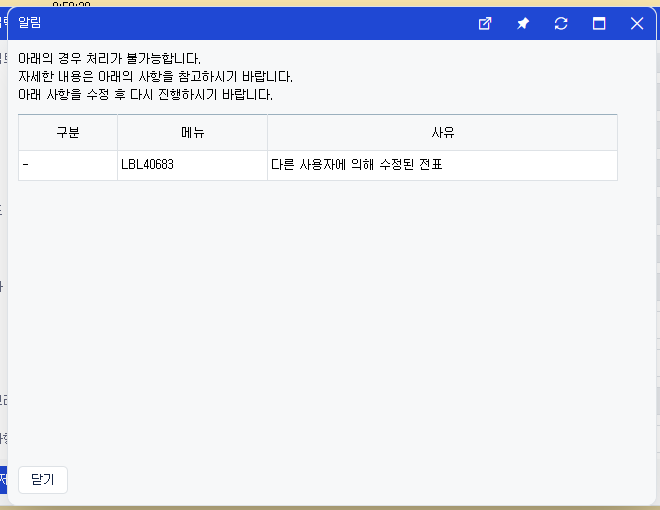

# Daily Retrospective

**작성자**: [허수경]  
**작성일시**: [2025-02-19]

## 1. 오늘 업무 내용

- 파일버전체크

### 파일버전체크
- 파일버전체크는 전표를 수정 또는 삭제할 때, 해당 전표의 버전이 유효한지 확인하는 프로세스입니다. 이를 통해 수정된 전표가 이전 버전과 충돌하지 않도록 보장합니다.

* 구현화면



### 버전체크 로직
#### 1) 버전체크 속성 주입
- time_manage_attr_map.ts
- 버전체크는 아래 5가지 액션모드에서 동작해야합니다.
  - Modify, Delete, UnDelete, Confirm, UnConfirm
```ts
[EN_ACTION_MODE.Modify]: [
  // [#] 버전체크(A23_06342)
  definition_attrs.validator.check_version,
  // -------- POST_EXECUTER ---------------------
],
```

#### 2) 나의 버전과 DB 버전 비교
- CheckVersionProgram.ts

```ts
const version_no_val = dmc?.getValueByReferType<number>(version_no.id);
if (version_no_val == undefined) {
  return result;
}

const check_version_feature = this.execution_context.getFeature<IVersionCheckFeature>(IVersionCheckFeature);
const check_result = check_version_feature.checkVersion({
  data_sid: dmc?.getValueByReferType<string>(data_sid.id) ?? '',
  bizz_sid: dto.slip_data_model.bizz_sid ?? dmc?.getValueByReferType<string>(bizz_sid.id),
  version_no: version_no_val,
});
```

#### 3) 버전 정보 DB 조회 및 업데이트
- BizzVersionCheckFeature.ts
- checkVersion와 addVersion를 통해 버전 정보를 DB 조회 합니다.
  - Dac에서 버전을 업데이트할 경우, 업데이트가 성공하면 1을 반환하고, 버전이 일치하여 업데이트를 하지 않으면 0을 반환합니다.
  - 반환된 값을 통해 업데이트 결과를 확인하고, 성공 여부에 따라 적절한 처리 result를 반환합니다.
```ts
const version_dac = DacCommandBuilder.create(UpdateCommonSingleVersionDac, this.context, this.target_db);
  const update_result = version_dac.execute({
    data: dto,
    target_table: this.target_db_tables,
  });
  if (update_result < 1) {
    // exception 발생 - 버전체크 로직 수행 문제
    result.success = false;
    result.message = _.vFormat($Resx.rex00127, $Resx.rex00004);
  }
```


- 단, 테이블 정보를 넘겨주는 것이 하드코딩 되어 있어 개선할 점입니다.

```ts
if (_.vIsEquals(bizz_type, EN_BIZZ_TYPE.TimeManage)) {
  this.target_db = DbConnectionId.PG.COMMON;
  this.target_db_tables = pg.bd_time_manage_single;
}
```


#### 4) 버전 업데이트 및 조건 처리
- UpdateCommonSingleVersionDac
- BizzVersionCheckFeature 에서 넘긴 테이블 정보로 조회합니다.
- where 조건에서 현재 버전과 DB의 버전이 동일한 경우에만 업데이트를 수행합니다.
- set 구문을 사용하여 DB의 버전 정보를 현재 버전 +1로 업데이트합니다.
```ts
const esql = $ESql.update<TData>(data.target_table, undefined, (opt) => {
    opt.alterCheckColumnRule(ENUM_CONDITION_LEVEL.HIGH, (t) => [t.tenant_sid, t.data_sid]);
  });
  esql.set(
    (t) => t.update_dtm,
    (ef) => ef.datetime.now()
  )
    .set(
      (t) => t.version_no,
      (ef, t) => ef.plus(Number(data.data.version_no), 1)
    )
    .set((t) => t.update_sid, this.execution_context.session.user_sid)
    .where((ef, t) => ef._equal(t.tenant_sid, this.execution_context.session.tenant_sid))
    .whereIfNotEmpty(data.data?.bizz_sid, (ef, t) =>
      ef._equal(t.bizz_sid, data.data.bizz_sid ?? this.execution_context.action.bizz_sid)
    )
    .where((ef, t) => ef._equal(t.data_sid, data.data.data_sid))
    .where((ef, t) => ef._equal(t.version_no, data.data.version_no));
```


## 2. 동기에게 도움 받은 내용 (필수)

- 주현님과 승준님께서 datetime 형식에 빈 값이 들어갈 수 있는지에 대해 함께 확인해주셔서, 데이터 처리에 있어 빈 값 처리에 대한 명확한 방향을 잡을 수 있었습니다. 

- 현철님께서 5.0 버전에 유사한 기능이 있는지 점검해주셔서, 기존 시스템의 구조와 구현 방식을 이해하고, 구현에 대한 시간을 줄일 수 있었습니다.


---

## 3. 개발 기술적으로 성장한 점 (선택)


### 2. 오늘 직면했던 문제 (개발 환경, 구현)와 해결 방법

#### 1) `version_no`를 못찾는 에러
- 문제: CheckVersionProgram에서 data_model에 있는 `version_no` 값을 가져오지 못했습니다. data_model에는 값이 있었으나, getValueByReferType을 통해 해당 값을 가져오지 못했습니다.
- 원인: 로직을 살펴본 결과, object - Master에서 `version_no가` 빠져있는 것을 발견했습니다. 이로 인해 getValueByReferType 함수가 version_no 값을 찾지 못한 것이 문제였습니다.
- 해결 방법: `version_no` 값을 포함하는 객체가 제대로 정의되도록 수정하여 값을 정상적으로 반환받을 수 있게 했습니다.


#### 2) IVersionCheckFeature를 못찾는 에러
- ModifyBasicAction.ts 에서 Feature를 주입하지 않아 생겼던 에러였습니다.

```ts
configuration_context.setFeature<IVersionCheckFeature>(
  IVersionCheckFeature,
  new BizzVersionCheckFeature(execution_context)
);
```