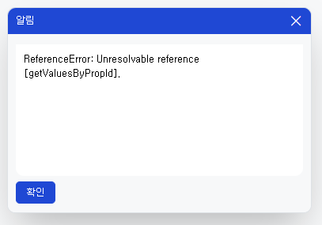

# Daily Retrospective

**작성자**: [황주원]  
**작성일시**: [2025-02-19]

## 1. 오늘 배운 내용 (필수)
### 한 row 에 대한 업무 유효성 검사
수정/조회시점에 한 row 에 대한 유효성 검사

1. **resolver를 통해 GetTimeManageMasterProgram 이 실행되도록 구현**
    ```ts
    const record = data_model_resolver_program.execute({
        action_mode: dto.slip_data_model.action_mode,
        dmc,
        data_sid: dmc.getValueByPropId<$$sid>('data_sid'),
        additional_info: {
            isValidator: true, // checkEDT 주원: 접두어 구문에 대한 조건문 처리
        },
    });
    ```
2. getTimeManageMasterProgram에서 접두어를 추가하는 구문이 있어 해당 구문을 빼는 로직 추가
    ```ts
    // checkEDT 주원: 접두어 뺀 validator 조건문 처리
    if (dto.additional_info?.isValidator) {
        return dac.execute({ data_sid: dto.data_sid });
    }
    return this._getAddedPrefixDatas(dac.execute({ data_sid: dto.data_sid }));
    ```

3. GetTimeManageSingleDac에서 조건문 처리가 이상하게 되어 있는 것을 확인 후, 수정
    > 성재님께 문의 드려보니 data_sid 조건 처리로 수정하는 것으로 결정

    ```ts
    if (!_.vIsEmpty(data.data_sid)) {
        esql.where((ef, t) => ef._equal(t.record_sid, data.record_sid));
    }
    ```

## 2. 동기에게 도움 받은 내용 (필수)
* 도형님께서 datamodel resolver 에서 발생한 오류를 함께 고민해주셨습니다.
* 민준님께서 pre executer 에러를 함께 고민해주셨습니다.
* 다른 동기들도 문제들에 대해 함께 고민해주셔서 모두 다 감사합니다!

---

## 3. 개발 기술적으로 성장한 점 (선택)

### 1. 교육 과정 상 배운 내용이 아닌 개인적 호기심을 해결하기 위해 추가 공부한 내용

### 2. 오늘 직면했던 문제 (개발 환경, 구현)와 해결 방법
조회 > 선택삭제시 ModifyStatusExecuteSetupMainProgram 공통로직에서 153 줄인 pre executer 프로그램을 실행시켜야 하는데 에러가 발생했습니다.

```ts
//------------------------------------------------------------------------
// [#1] pre_executer resolver
//------------------------------------------------------------------------
pre_executer_resolver_program.execute({
    definitions: this.smc.getDataModelDefinitions(),
    slip_attributes: this.smc.getAttrsByAttrType(EN_ATTR_TYPE.PreExecuter),
    slip_data_model: slip,
});
```

[에러 화면] <br />


원인은 모른채 디버깅을 해보니, SlipDataModelContainerBase 165번째 줄에서 undefined 가 떴습니다. <br />
dto.parent_data_model_id 는 `time_manageXmaster` 였고, SingleInput 일 때 master를 주입해 주는 코드가 위에 있었습니다. 

```ts
this.dmc[dto.parent_data_model_id].getValuesByPropId(dto.prop_id).forEach((propData) => {
    const sub_array_data = propData ? propData[data_prop_id] : null;
    sub_array_data && result.push(...sub_array_data);
});
```

근데 singleInput이 아니라 조회의 상황이 아닌가? singleInput 이 맞을까 ? 라는 생각에 `time_manageXlist` 로 임의로 값을 변경해서 넣어봤습니다. <br />
`time_manageXlist` 로 변경했을 때 pre validator 가 잘 실행되어서 해당 사실을 팀장님께 공유했으며, 성재님과 현철님의 파트라고 알려주셔서 전달드렸습니다.

이후 현철님께서 `3641 | [EDT팀] 이슈상황공유 - 조회 선택삭제 시 부속어레이 관련 오류 ` 제목으로 올려주신 것을 보면서 부속 어레이 관련 오류란 것을 알 수 있었습니다.
