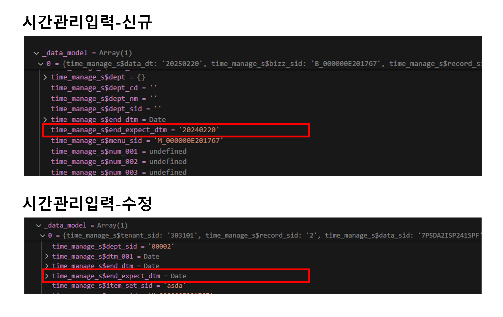

# Daily Retrospective

**작성자**: [허수경]  
**작성일시**: [2025-02-20]

## 1. 오늘 배운 내용 (필수)

### 저장 후 알럿 처리 로직

#### 1) 명세내용
시작일자 종료일자 값이 있는 상태에서 담당자 수정저장시, 알림창 제공한다.
시간관리에서 시작일자(or 종료일자)가 입력되어 있을 때 담당자 수정저장  시 기존의 거래 진행상태 폐기한다.
변경한 담당자로 진행상태 예정인 신규 거래가 생성된다.

#### 2) 담당 업무
- 신규 거래 생성 시 알럿을 띄우는 역할을 담당한다.

#### 3) 어느 시점에서 알럿을 띄울까?
일단 기존 5.0 기능에서는 거래를 생성하고 알럿을 띄우는 기능이 없다고 합니다. (과거에는 존재했지만, 사용자가 저장 버튼을 눌러 저장을 인지하는 상황에서 굳이 알림을 띄울 필요가 없다는 판단으로 제거된 것으로 들었습니다.)

게다가 시간관리의 경우, 수정저장 버튼을 눌렀을 때 두 가지 경우가 존재하기 때문에 특별한 케이스라고 생각합니다. 
1) 일반적인 수정 저장, 
2) 현재 거래의 상태를 폐기 처리하고 새로운 거래를 생성하는 경우입니다.

알럿을 띄우는 시점은 서버의 ExecuteSetupMainProgram에서 저장이 완료된 후, UserAction에서 처리하는 것이 적절하다고 판단됩니다. (저장 여부를 리턴받아 UI에서 처리하는 것이 역할이라고 생각하기 때문에)
하지만 두 가지 경우가 존재하기에 2번일 경우에만 알럿을 띄워야 하는데, 현재 서버에서 반환하는 값으로는 이를 분기 처리하기에 적절하지 않습니다. 

이에 대한 해결 방안으로, 새로운 거래가 생성된 여부를 저장하는 항목(isNewBoard)을 추가하는 방안을 생각해보았습니다. 
담당자 값이 변경되어 새로운 거래를 생성할 때 해당 값을 true로 설정하고, UserAction에서 이를 확인하여 알럿을 띄우는 방식입니다. 
저는 아래와 같은 코드로 생각하고 있으며, 새로운 거래를 생성하는 주현님과 값을 변경하는 현철님 또한 return 을 어떻게 해야할지 같이 고민하고 있습니다.

```ts
// CreateAndModifyBasicSlipUserAction.ts
if (dmc.getValueByReferType('isNewBoard')) {
	vmc.alert($Resx.xxx); // 현재 거래는 폐기처리되고 새로운 거래가 생성되었다는 메시지
}
```


## 2. 동기에게 도움 받은 내용 (필수)

- 제가 자리를 비운 동안 건호님께서 shutdown을 대신 해주셔서 원활하게 대화를 이어갈 수 있었습니다.
- 현철님과 주현님과 함께 변경 여부를 어떻게 넘길지에 대해 논의하며, 이를 리액트에서 처리할 수 있다는 사실을 알게 되었습니다.
- 민준님께서 디버깅을 통해 서버에서 브라우저로 다시 data model을 전달하는 과정을 확인해주셨고, 덕분에 제가 고민하던 방안을 더 확신할 수 있었습니다.
- 주원님께서 전체 빌드 시 발생하는 에러를 발견해주셨고, 강민님께서 해결 방법을 제시해주셨습니다.
- 강민님께서 FE팀에 직접 문의해주신 덕분에 문제를 보다 정확하게 파악할 수 있었습니다.
---

## 3. 개발 기술적으로 성장한 점 (선택)


### 2. 오늘 직면했던 문제 (개발 환경, 구현)와 해결 방법

#### 1) datetime 빈 값 처리
**명세 내용**<br>
- 시작일자 값이 있을 때 종료일자[4932]값이 시작일자보다[4931] 보다 이전인 경우 저장(F8) 시 저장되지 않고 체크한다

**문제**<br>
- 시작일자가 빈 값일 수 있는데 datetime이 자동으로 현재일시를 가져오고 있어 빈 값을 어떻게 넣어줄 지 고민을 했습니다.
- storybook으로 확인을 해보았을 때도 빈 값을 설정했을 때, 에러가 발생했습니다.
- 따라서, FE 부문에 문의를 드렸습니다.(강민 파트장님을 통해)
  - 답변으로는 datetime에 빈 값을 설정할 수 없다는 것을 확인 받았습니다.

**해결 방법**<br>
- 현철님 또한 시작일자의 빈 값 가능 여부에 따라 업무가 바뀌는 경우였기에 현철님께서 방향결정 게시판에 문의를 하셨습니다.

```
FE부문 통해서 일시형 항목도 null값 가능하게 할지,
일시형항목을 일자형으로 변경할지 방향 문의드립니다.
```

- 위와 같은 문의를 통해 "시간관리업무"의 시작/종료일 일시형 => 일자형으로 변경되었습니다.


---
### 3. 위 두 주제 중 미처 해결 못한 과제. 앞으로 공부해볼 내용.

#### 종료예정일자 타입 
- 동일 시점에 디버깅을 진행했을 때, 종료예정일자의 입력 값 데이터 타입이 다르게 나타나는 현상이 확인되었습니다.
  - 시간관리(신규) 입력: 종료예정일자가 string 타입으로 들어옴
  - 시간관리(수정) 입력: 종료예정일자가 Date 객체로 들어옴
- 이에 대한 해결이 필요합니다.


