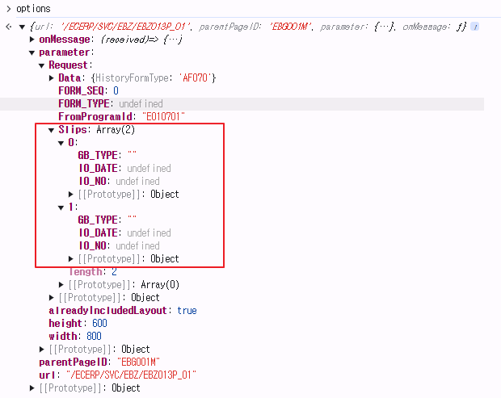

# Daily Retrospective

**작성자**: [황주원]  
**작성일시**: [2025-02-21]

## 1. 오늘 배운 내용 (필수)
### 인쇄 UserAction 적용
인쇄 로직은 현재 `PrintMultiSlipUserAction` 과 `PrintV3AccountSlipUserAction` 로 크게 나뉘는 것 같습니다. 앞은 5.0 UserAction에서 3.0 UserAction을 호출하고, 뒤는 3.0 UserAction입니다. 

20250221 기능명세 기준으로 시간관리현황 페이지에서 인쇄 버튼(4518)을 클릭했을 때, <br />
전체 항목에 대한 인쇄가 아닌 선택된 항목에 대한 인쇄가 되어야 합니다.

조회에서의 인쇄 UserAction은 `PrintMultiSlipUserAction` 을 적용해야 했고, 적용해보니 인쇄 팝업창이 떠지지 않는 이슈가 발생했습니다. 

코드를 봤을 때, 업무가 timemanage면 filter_programs 에 push 해주지 않으니 당연히 slip 에 값을 넣고 있지 않습니다.
```ts
// 업무별 필터프로그램 등록
const filter_programs = [] as ProgramIdentifier[];
const bizz_type = execution_context
    .getFeature<attribute.IAttributeFeature>(attribute.IAttributeFeature)
    .getBizzAttr(bizz_attrs.bizz_type)?.data;
switch (bizz_type) {
    case EN_BIZZ_TYPE.Account:
        filter_programs.push(IFilterEApprovalProgram);
        break;
}

if (!_.vIsEmpty(filter_programs)) {
    // 로직 실행
    // ...
    slips.push(...filter_pass_datas); // 선택한 row 들을 push 해줌
}
```

팝업을 띄우는 프로그램에서는 slip 을 기준으로 3.0 테이블에서 값을 조회하게 되는데 slip 에 값이 들어가 있지 않으니 팝업을 띄우지 않고 close 하는 이슈가 발생했습니다.


임의로 값을 넣으려고 했지만 dto 형식이 3.0에 맞춰져 있어서 넣기가 어려웠고, 해당 이슈를 팀장님께 공유했습니다. 

팀장님께서 ERP 화면을 보시고 기능명세에 잘못 기재되어 있다는 결론을 내리셨습니다. <br />
파악한 로직을 적용시키지 못해 조금은 아쉽지만 3.0 프로그램을 실행시키는 방법이나 setup 설정 방법을 알게 되어 좋은 경험이었습니다.

## 2. 동기에게 도움 받은 내용 (필수)
* 민준님께서 3.0 setup 추가해야하는 부분을 알려주셨습니다. + 전반적으로 디버깅도 도와주셨습니다 감사합니다 !
* 강민님께서 속성 부분의 디버깅을 도와주셨습니다. 감사합니다 !

---

## 3. 개발 기술적으로 성장한 점 (선택)
### 2. 오늘 직면했던 문제 (개발 환경, 구현)와 해결 방법
#### 저장시점 로직 수정
시간관리 > 저장시점에서 필수값은 업무 > 거래 밖에 없습니다.

현재 저의 로직에서는 프로젝트, 설계, 기획, 개발에서 bizz_sid 를 명시해 주고 있으니깐 data 값이 안 들어 가게되면 notnull 체크를 건너뛰고 삭제전표유효성 검사에서 걸리게 되었습니다.

해당 로직을 수정하기 위해 bizz_sid 가 명시되어 있지만 value 값이 들어오지 않을 때 건너뛰는 로직으로 수정해 주니 에러를 막을 수 있었습니다.
```ts
if (attr.data.bizz_sid && _.vIsEmpty(value)) return;
```


### 3. 위 두 주제 중 미처 해결 못한 과제. 앞으로 공부해볼 내용.
* regex 로직 확인

---

## 4. 소프트 스킬면에서 성장한 점 (선택)
5.0과 3.0 로직을 확인해보면서 이해가 가지 않은 부분을 많이 발견했습니다. 인쇄 로직은 속성으로 map 을 호출했지만 결국은 하드코딩이 들어가게 됩니다. 이 부분들을 다 제거하는 것이 목적이고 히스토리는 잘 모르지만 속성으로 실행시키는 만큼 속성으로 다시 가져오면 되지 않을까 ? 하는 의문이 한가득 남게된 하루였습니다. 

하루종일 5.0 > 3.0 useraction 을 태우는 로직을 확인해보고 분기처리를 해보려고 했는데 기능이 잘못된 것이였다하셔서 조금은 아쉽기도 했습니다. 이런 아쉬움도 다시 생각해보면 그만큼 열심히 노력했기 때문에 남는 아쉬움이라 생각이 들면서 오늘도 성장했습니다 !!!
